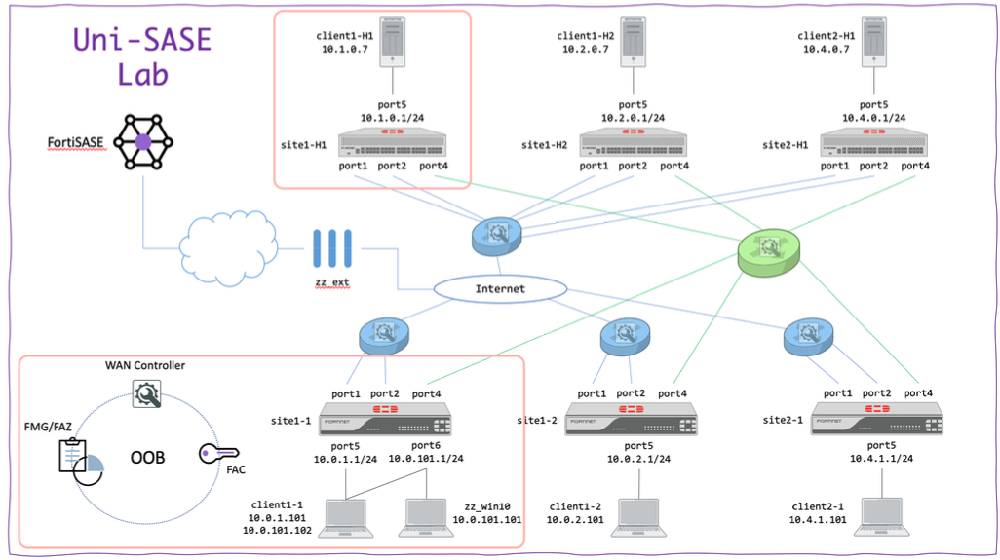
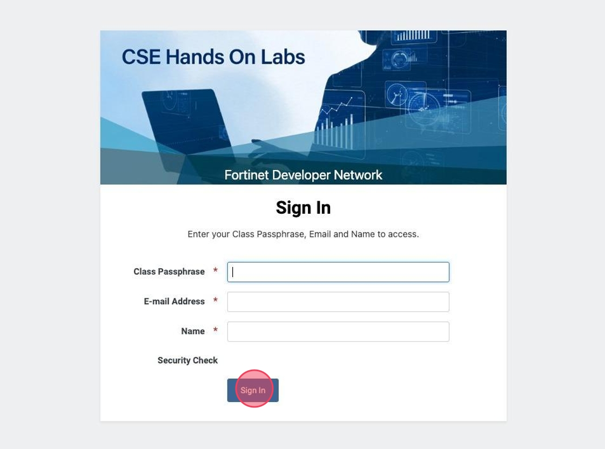
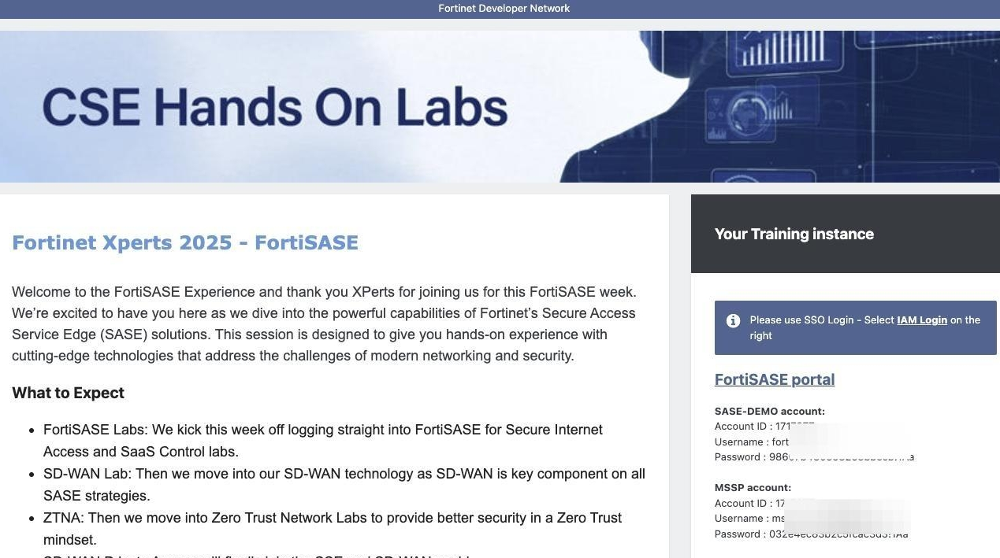
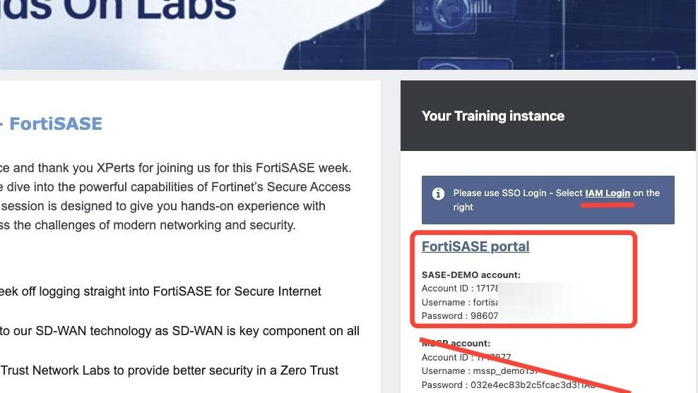
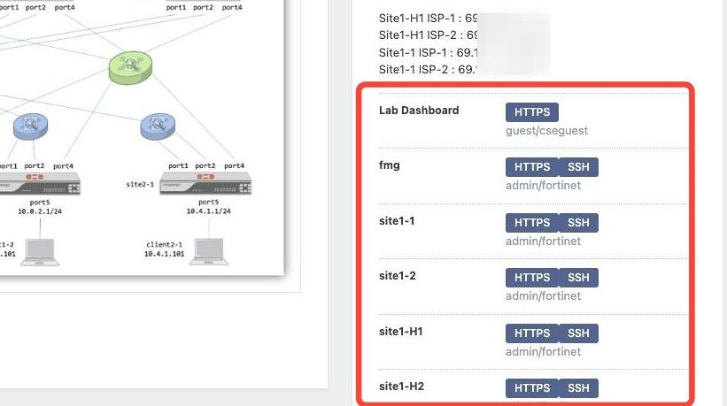
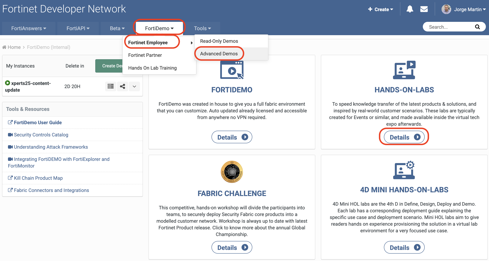
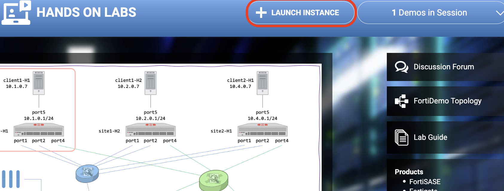
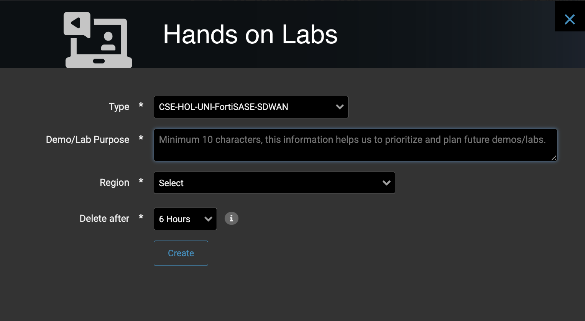
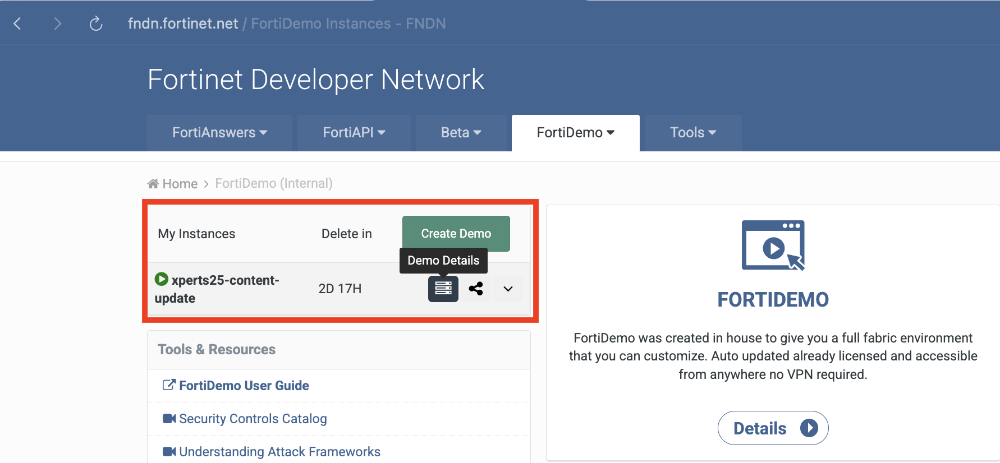
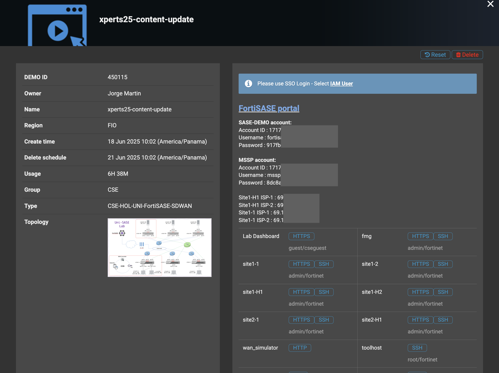

# Secure SDWAN Laboratory Index

## Lab Overview

On this Lab we will cover the following content:

* SD-WAN Provisioning with FortiManager
* FortiManager Provisioning Templates and SD-WAN Overlays
* SD-WAN Traffic steering, dynamic routing, static routing, firewall policies
* SD-WAN Testing and Troubleshooting

## Lab Architecture

General Lab architecture

{ width="1000" }

## Accessing your Lab

There are 2 ways to access the Lab

1. [Fortinet Event](index.md#accessing-the-lab-at-fortinet-event)
1. [Fortinet FNDN](index.md#accessing-the-lab-from-fndn-hol)

### Accessing the lab at Fortinet Event

1. Navigate to <https://fndn.fortinet.net/cse>

1. Set
    - **Class Passphrase:**
    - **E-mail Address:** *Your e-mail address*
    - **Name**: *Your name*
    - **Security Check:** *Convince the captcha you are not a robot!*

    { width="600" }

    ???+ tip

        If you lose access to the Lab you can always come back to the sign in and use the same e-mail address to get access to your lab.

1. You should get to a Portal like this, here you can navigate the environment.

    { width="800" }

1. Use the **SASE-DEMO account**  credentials to connect to the FortiSASE environment, do not use *MSSP account*.

    { width="600" }

1. Access the Different devices from the menu on the right.

    { width="600" }

### Accessing the lab from FNDN HoL

1. Navigate to [fndn.fortinet.net](https://fndn.fortinet.net) -> FortiDemo -> Advanced Demos -> HANDS-ON-LABs, you can use direct [link](https://fndn.fortinet.net/index.php?/fortidemo/instances/&details=handsonlabs&c=1018&video=1408&slug_id=unified_sase)

    { width="1000" }

1. Navigate to SASE -> Unified-SASE

    { width="1000" }

1. Click **+ Launch Instance**

    { width="600" }

1. Fill in the required information then click **Create**

    { width="600" }

1. Wait for a couple of minutes until the lab launches, once it's ready it will send you an e-mail with the lab information, you can also access the lab from [fndn.fortinet.net](https://fndn.fortinet.net) -> FortiDemo -> Advanced Demos

    { width="600" }

1. Click on **Demo Details** to see your lab environment information.

    { width="600" }

## Additional Notes

There are additional resources on this documentation at your disposal:

1. If you finish early and want to tag additional challenges you can get into the [Take the Challenge](take-the-challenge.md) section to find additional labs you can do with your deployed instance.

1. If you have any problem with you FortiManager deployment you can go to the [Troubleshooting](troubleshooting.md) section where you can find steps to download backups and restore your lab.

## FortiSASE Versions

Starting on July 2025 FortiSASE is available in two version

* [Feature:](SSE_Feature/01-fortisase.md) This is an opt-in version of FortiSASE that is considered more unstable due to the introduction of new features every update cycle (monthly)
  
* [Mature:](SSE_Mature_25/01-fortisase.md) This is the main stable version for customer which won't be introducing many new features to keep compatibility and stability.

FNDN Instances are currently using Feature version, this documentation contains labs for both versions under naming convention **Lab F** for featured and **Lab M** for mature version, you will find corresponding labs at the main menu.

To continue Click [Here for Feature Labs](SSE_Feature/01-fortisase.md) or [Here for Mature Labs](SSE_Mature_25/01-fortisase.md)
