# Troubleshooting

## Recovering from Backup

1. If something goes wrong we have FortiManager Backups for some Labs finished, you can download Backup from: <https://storage.googleapis.com/jmc_xperts25/AmerIntl_4D_SASE_BK_Aug9.zip>

1. Follow the following procedure to recover from Backup

1. Log into FortiManager

    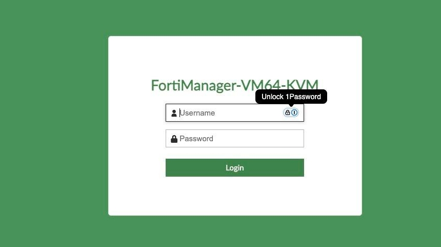{ width="600" }

1. Select the root ADOM

    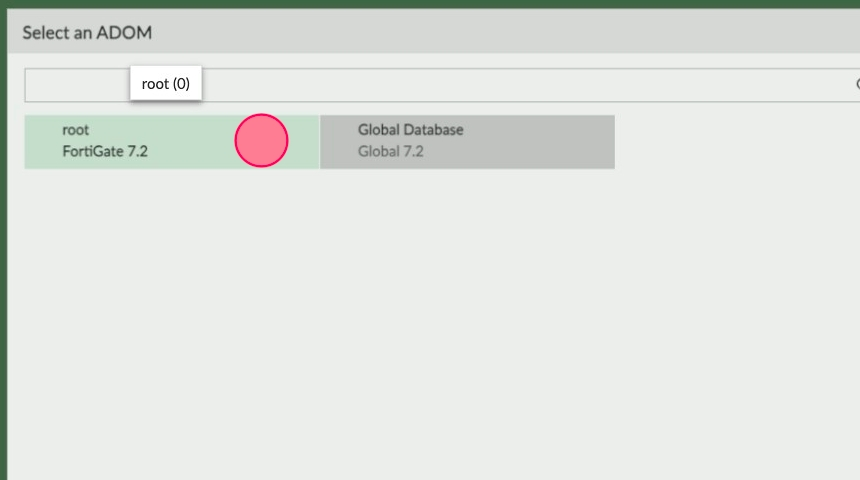{ width="600" }

1. At the Dashboard click on **Restore**

    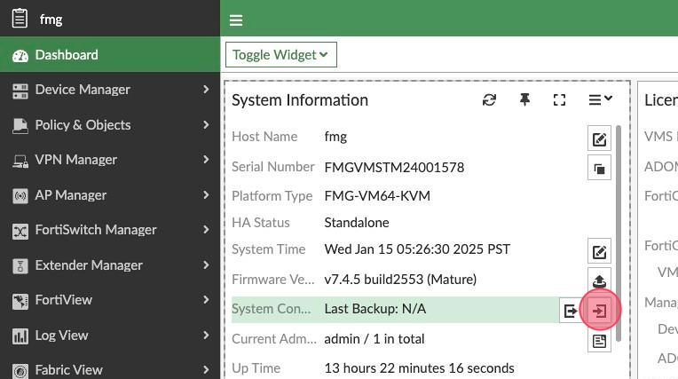{ width="600" }

1. Upload the Backup file, Set
    - **Password**: *fortinet*
    - **Overwrite current IP, routing and HA settings**: *Disable*

    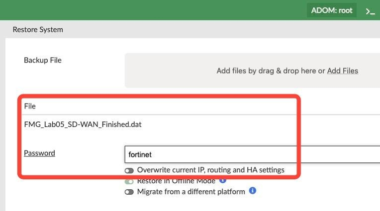{ width="600" }

    Click **OK**

1. Wait for FortiManager to reboot then login again, now enter the **XPerts25** ADOM

    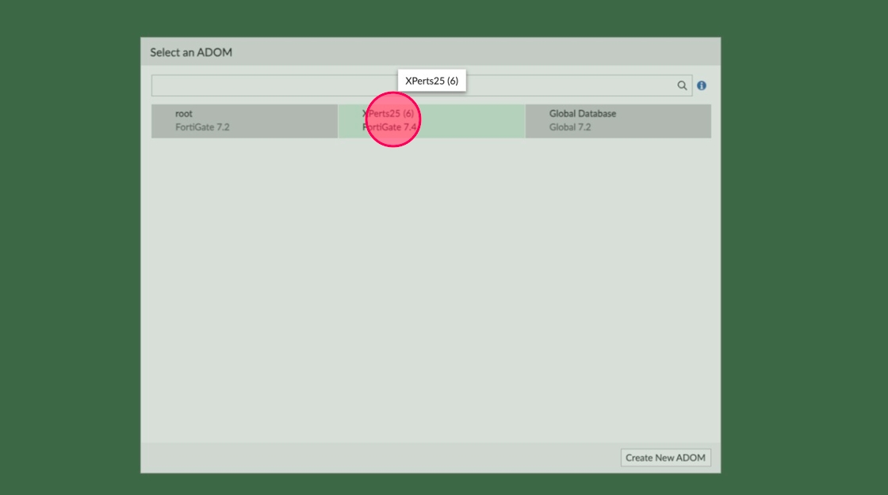{ width="600" }

1. Connect to the **toolhost (SSH)**

    Use direct SSH for better results
    ```bash
    ssh root@<your lab url> -p 11019
    ```

    Change directory to /fortipoc/autodeploy

    ```bash
    cd /fortipoc/autodeploy
    ```

    Download LATAM scripts (If you have not done it before)

    At Toolhost
    
    ```bash
    wget https://storage.googleapis.com/jmc_xperts25/XPerts25_FSASE_Scripts.zip
    unzip XPerts25_FSASE_Scripts.zip
    chmod +x generate_inventory_lat.py fix_fmg_fgtsn_postrestore.py
    ```

    Execute fix_fmg_fgtsn_postrestore.py to update the SN of the VMs to your environment

    ```bash
    ./fix_fmg_fgtsn_postrestore.py
    ```

    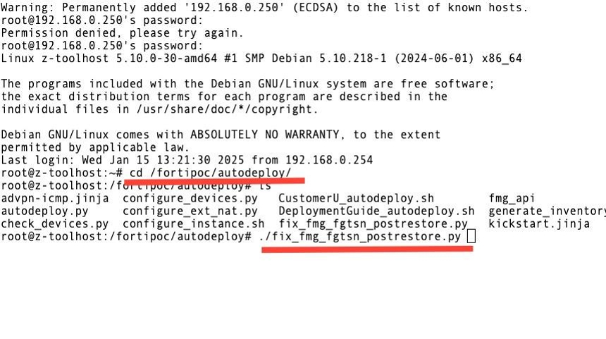{ width="600" }

1. Output should look like this.

    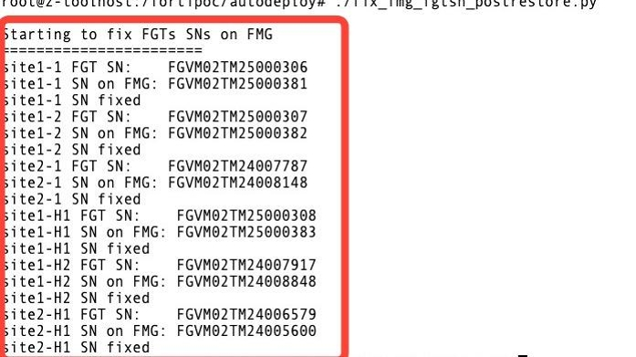{ width="600" }

1. Execute

    ```bash
    ./onboard_devices.py
    ```

    { width="600" }

1. Go Back to FortiManager and Navigate to **System Settings -&gt; Advanced -&gt; Misc Settings**

    Set
    
    - **Offline Mode:** *disabled*

    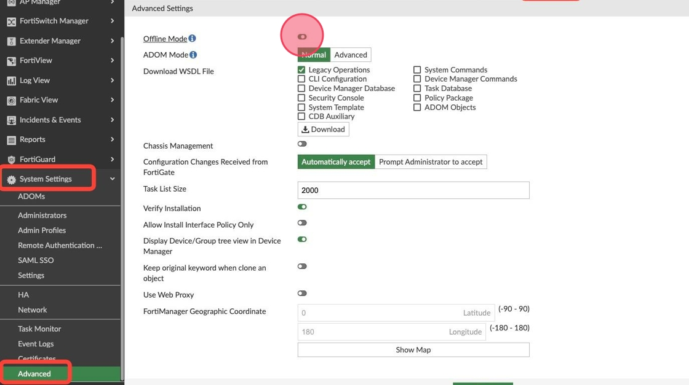{ width="1000" }

    Click **Apply**

1. Navigate to **Device Manager -&gt; Device & Groups -&gt; Managed FortiGate**

    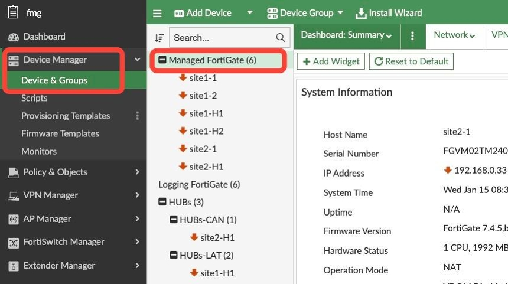{ width="600" }

1. Click on the Bell, it will tell you there are 6 devices configuration out of sync, that's because we did not restore FGTs configuration and there are far from the FMG expected configuration, click on the message.

    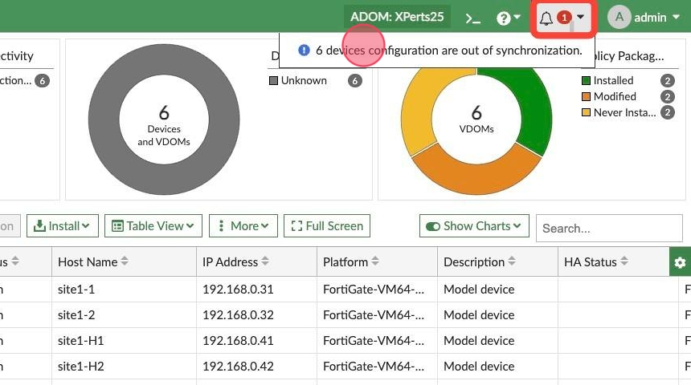{ width="600" }

1. Select all devices

    Click **Revert**

    Click **OK** at the warning message

    Click **Close**

    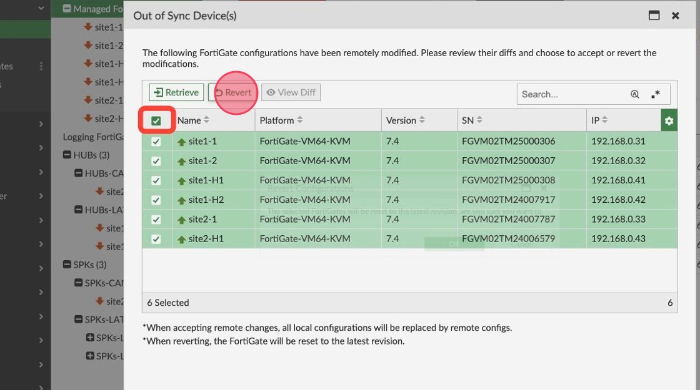{ width="600" }

1. Click the **Tasks**, there will be an installation Task, click on the **install config** task.

    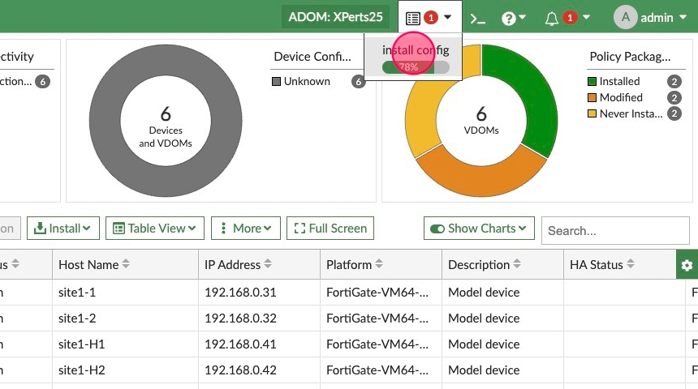{ width="600" }

1. Double click the **Install Configuration** to display progress of each task

    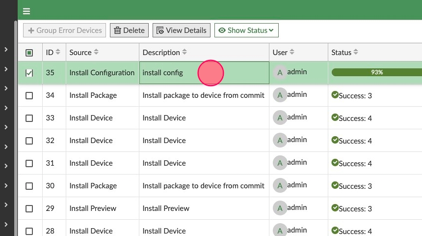{ width="600" }

1. Notice the progress for each device.

    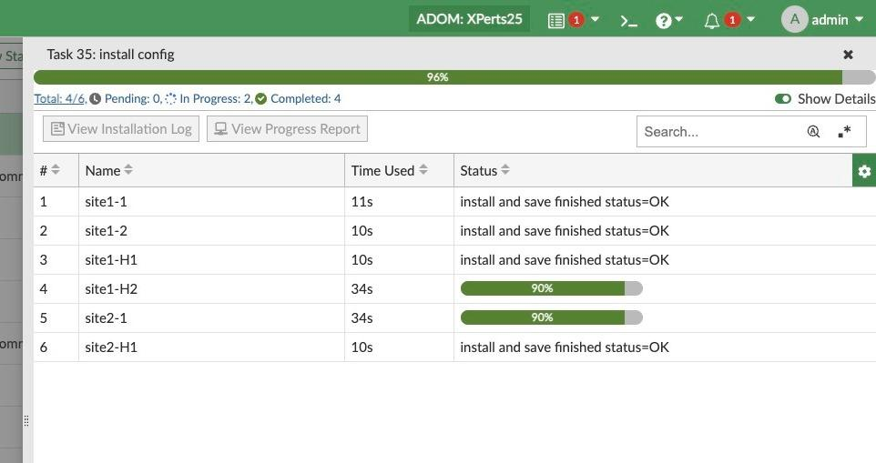{ width="600" }

1. Navigate to **Device Manager -&gt; Device & Groups**

    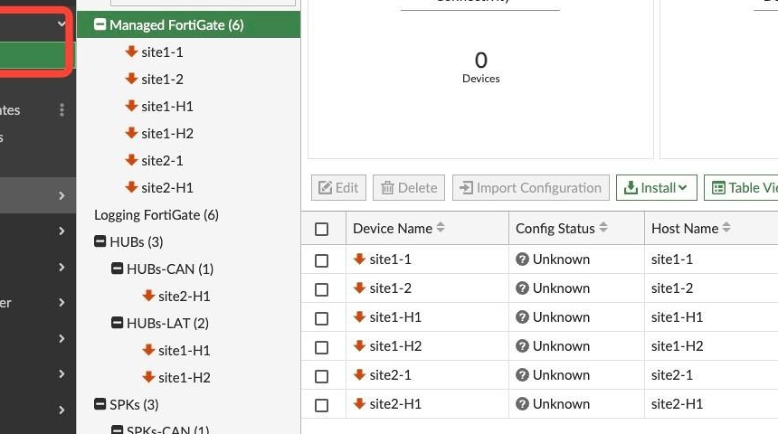{ width="600" }

1. Click **Install Wizard**

    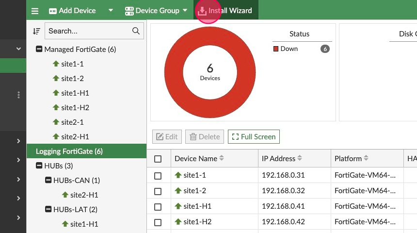{ width="600" }

1. Install all the Policy Packages to make sure everything is in sync.

    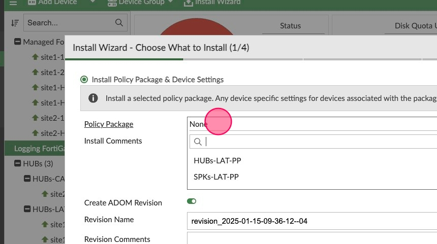{ width="600" }

1. Check that everything is OK, depending on which lab you are recovering you can check

    - VPN Monitor
    - Connect to each FortiGate and see configurations are there
    - Do ping tests
