# FortiOS 8.0 Post-Quantum Encryption (PQC)

## Use Case: Agentless VPN with Post Quantum Cryptography (PQC)

| Info | Result |
| ---- | ---- |
| Time to Complete | 30 Minutes |
| Dependencies | N/A |
| About | FortiOS now supports Post-Quantum Cryptography (PQC) for Agentless VPN, introducing new CLI options that allow selection of pure and hybrid PQC algorithms to prepare for future quantum computing threats. In this lab you will configure Agentless VPN to use PQC for Secure Remote Access |

### Configure VPN Users and User Groups

1. Open **fgt1-v8**

1. Navigate to **User & Authentication** -> **User Definition**, click on **Create New** to create a new VPN user and set the following parameters on the Wizard:

    - **User Type:** *LOCAL*

    - **Name:** ```user1```

    - **Password:** ```Fortinet123#```

    - **2FA:** keep disabled

    - **User Group:** Enable

    - **Add To Groups:** Click to Select and then click on Create

        - **Name:** ```UserGroup1```

        - **Type:** Firewall

        - Click on OK

    - Select the group **UserGroup1**

    - Click Submit

    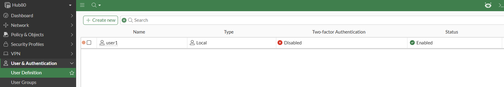{width="600"}

### Configure Agentless VPN Portals

Now let us configure the Portals that will allow us to map users to services. 

1. Navigate to System -> Feature visibility and expand Agentless VPN to check the required CLI command to enable it

    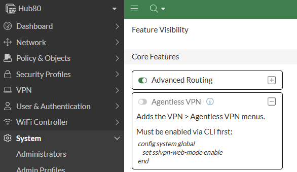{width="600"}

1. Open a CLI Console and apply the commands below:

    ```
    config system global
        set sslvpn-web-mode enable
    end
    ```

1. Now refresh the page and enable Agentless VPN

    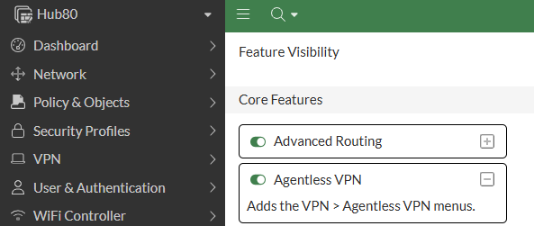{width="600"}

1. Click Apply

1. Navigate to **VPN** -> **Agentless VPN Portals**, click on **Create New** and use the following parameters:

    - **Name:** ```Finance-Win```

    - **Limit Users to One Agentless VPN Connection at a Time:** :white_check_mark:

    - **Default Protocol:** RDP

        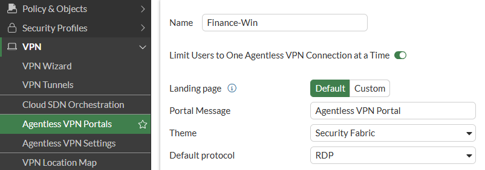{width="600"}

1. Click **Create New** under Predefine Bookmarks and use the following settings:

    - **Name:** ```Windows-Desktop```

    - **Type:** RDP

    - **Host:** ```172.16.1.10```

    - **Description:** ```Windows App Server```

    - **Screen width:** ```1920```

    - **Screen height:** ```1080```
    

    !!! tip "Tip"

        You can change the default window size (1024 × 768) in the portal’s CLI configuration to apply it to all bookmarks and connections.  
        default-window-width        Screen width (range from 0 - 65535, default = 1024).  
        default-window-height       Screen height (range from 0 - 65535, default = 768).  
        This setting can also be overridden by specifying a window size within an individual bookmark’s configuration like we did in this example.  
    
    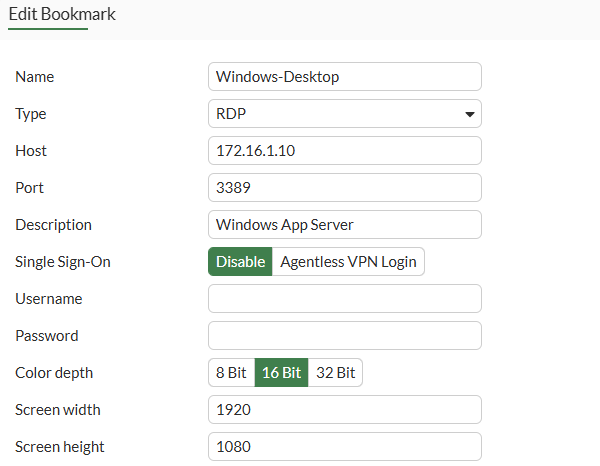{width="600"}

1. Click OK and then Click OK

    ???+ info

        Next, we will create a final portal for authenticated users that do not have access to Agentless VPN services

1. Open the CLI Console and enter the following commands

    ```
    config vpn ssl web portal
        edit "disabled-portal"
        next
    end
    ```

1. Refresh your browser.

1. The result in the GUI should look like this

    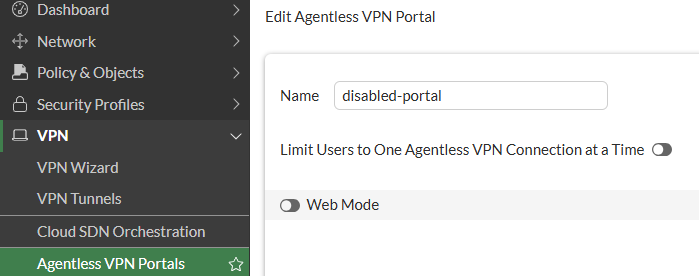{width="600"}

    !!! note "Best Practice"

        In the Agentless VPN settings, it is mandatory in the Authentication/Portal Mapping section to configure a portal for All Other Users/Groups or what can be considered a default portal for other users who are not specifically mapped to access Agentless VPN portals.
        
        When the Authentication/Portal Mapping does not match users or groups that you have specifically mapped to access Agentless VPN portals, you can create a custom Agentless VPN portal and disable web-mode using the CLI, and then set default portal to that custom portal. This configuration is analogous to the implicit deny policy in firewall policies, in that this custom portal can deny all other users and groups.
        
        For a default portal with web-mode disabled, users deemed part of All Other Users/Groups can still access the Agentless VPN portal. Once these users try to log in to the portal, access will be denied. Users deemed part of All Other Users/Groups should be unable to successfully establish Agentless VPN connection in this case. More information on best practices when securing Agentless VPN can be found here:
        
        [Agentless VPN Security Best Practices](https://docs.fortinet.com/document/fortigate/7.6.6/administration-guide/947829/agentless-vpn-security-best-practices){target="_blank"}

### Configure Agentless VPN Settings

1. Navigate to **VPN** -> **Agentless VPN Settings** and configure the following parameters:

    Set the following parameters:

    - **Listen on Interface:** *port1*
  
    - **Listen on Port:** ``8443``
  
    - **Server Certificate:** *Fortinet_Factory* 
  
        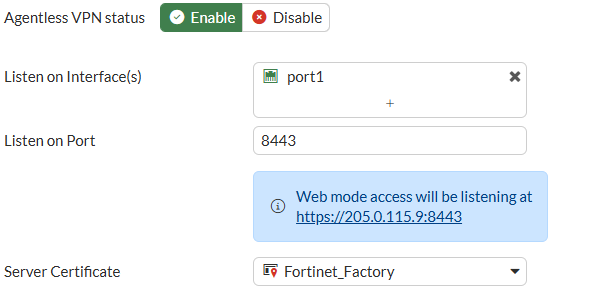{width="600"}
  
    Under ***Authentication/Portal Mappings***, click on ***Create New*** and use the following settings:

    - **Groups:** *UserGroup1*
  
    - **Portal:** *Finance-Win*
  
    - Click **OK** to save the new mapping.

    Edit the second mapping using the following settings:

    - **All Other Users/Groups** mapped to ***disabled-portal***

    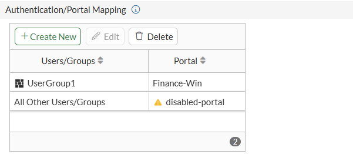{width="600"}

1. Click Apply

1. Open a CLI Console and apply the following commands:

    ```
    config vpn ssl settings
        set login-block-time 300
        set tls-groups ML-KEM512 ML-KEM768 ML-KEM1024 P-384-MLKEM1024 P-256-MLKEM768 X25519-MLKEM768
    end
    ```

    !!! tip "Tip"
        
        In general, any TLS Group that include the KEM keyword means it's a Post-Quantum Cryptography algorithm. As time of this writing, Supported groups include traditional elliptic curves (P-256, P-384, P-521), finite field Diffie-Hellman (FFDHE2048–8192), pure PQC (ML-KEM512, ML-KEM768, ML-KEM1024), and hybrid combinations (such as P-384-MLKEM1024, X25519-MLKEM768). PQC groups are currently unavailable in FIPS-CC mode pending FIPS 140-3 approval.

    !!! note "Best Practice"

        Always ensure to ban unsecure / outdated algorithms and protocols, enforce secure cyphers (for example at least TLS 1.2 which is still considered secure if weak cipher suites are disabled). More information on best practices when securing Agentless VPN can be found here:
        
        [Agentless VPN Security Best Practices](https://docs.fortinet.com/document/fortigate/7.6.6/administration-guide/947829/agentless-vpn-security-best-practices){target="_blank"}

### Configuring Agentless VPN Policies

!!! tip "Stop and Think"

    We have configured the settings and portals mapping users to services and now we have to configure the policies to allow the users access those services. Why? Because the traffic flows through different interfaces: you see Agentless VPN connection terminate on the *ssl.root* interface (ssl VPN interface in the root vdom of the FortiGate) and as any other traffic flow between interfaces on FortiGates, we need to explicitly allow it via Security Policies.

1. Navigate to **Policy & Objects*** -> ***Firewall Policy***, click on *Create New* and use the following settings:

    - **Name:** ```AgentlessVPN-to-LAN```

    - **Action:** *Accept*

    - **Incoming Interface:** *Agentless VPN Interface (ssl.root)*

    - **Outgoing Interface:** port5

    - **Source:** all

    - **User/group:** UserGroup1

    - **Destination:** *DC_NET*

    - **Service:** *RDP*

    - **Application Control:** :white_check_mark: *default*

    - **SSL inspection:** certificate-inspection

    - Click **OK** to save the new policy.

    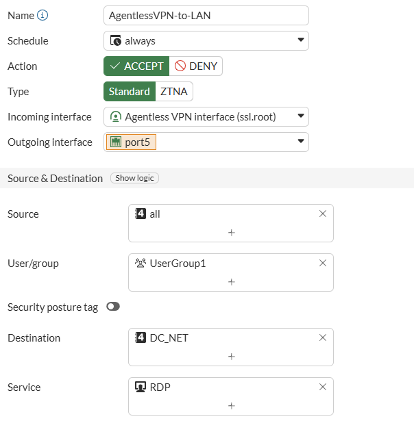{width="600"}

### Verification

Let's test our configuration using **win-cli1-site1**:

1. Connect to *win-cli1-site1* using RDP (Your instance FQDN:3390)

1. Be sure to disconnect from the SIA tunnel and/or remove the proxy settings (if you completed the SASE Labs), the ISP interface is enabled and the LAN interface is disabled.

1. Open Edge Browser and navigate use the bookmarks bar to access the Agentless VPN Portal. 

    Alternatively you can type ```https://205.0.115.9:8443```

1. Use the VPN credentials you created in the previous section to Connect to the VPN:  

    Username ```user1``` and password ```Fortinet123#``` and click on ***Login***

    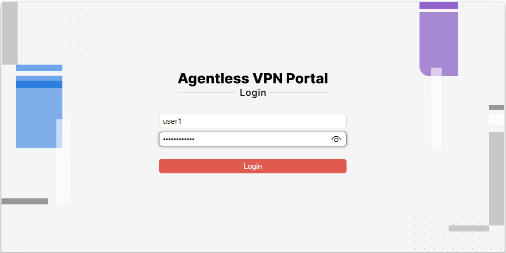{width="600"}

1. From here, you can either manually type the IP address of the host you would like to access and use the *Launch now* button or use the pre-defined bookmark

    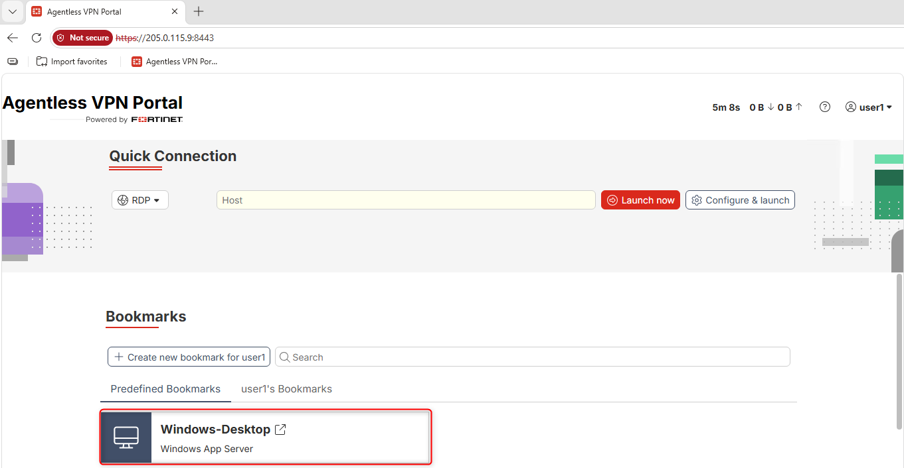{ width="600" }

1. Use the bookmark to launch the RDP service and login with the following credentials: Username ```admin``` and password ```Fortinet123#```. Note that these are the Windows host credentials and NOT the VPN credentials. 

    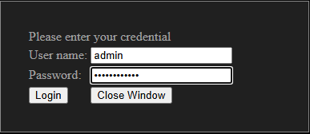

    You should be able to see the Windows Desktop and interact as a regular RDP session. Now let us verify what encryption algorithms our Agentless VPN session is using:  

1. On your Agentless VPN portal, press CTRL+Shift+i or navigate to the 3 dots icon on the web browser and go to ***More Tools*** -> ***Developer Tools*** to open the developer tools panel.  

1. Within the ***Developer Tools*** Panel, open the ***Security Tab*** and Search for *Connection* information. Notice the TLS version (*1.3*), TLS group (*X25519MLKEM768*) and Encryption Algorithm (*AES_256_GCM*) being used. As mentioned previously, "MLKEM" algorithms imply Post Quantum Cryptography.

    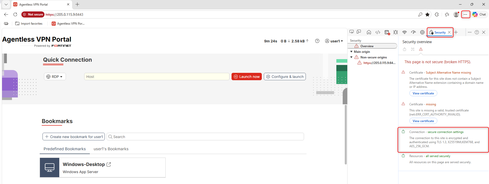{width="600"}

1. On Hub80, navigate to Dashboard -> Network Monitor and click on Add Tab

    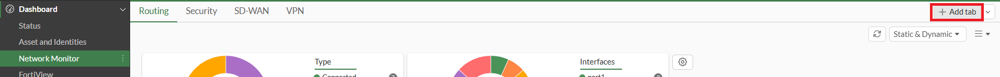{width="600"}

    - Name it ``Agentless VPN``, select Monitor and click Choose Monitor

    - Locate and select the Agentless VPN Monitor

    - Click OK

1. Verify that one connection is established and can be managed from the dashboard

    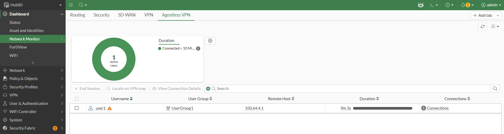{width="600"}

!!! success "Lab Completed"
    You have successfully implemented Post Quantum Cryptography for Agentless VPN