# FortiOS 8.0 Security Profiles

## Use Case: Securing GenAI

| Info | Result |
| ---- | ---- |
| Time to Complete | 60 Minutes |
| Dependencies | N/A |
| About | In this Lab you will explore the new features added to the Security Profiles, particularly when it comes to securing GenAI applications and SaaS Applications. You will create the configuration locally on the Hub FortiGate and use the On-net host to generate traffic and explore the new visibility controls added to FortiOS 8 |

### Create SSL Inspection Profile and AppControl Profile

1. Log into **Hub80**, navigate to **Security Profiles** -> **SSL/SSH Inspection**, Click on **Create new** and use the following settings:

    - **Name:** ```GenAI-DeepInspection```

    - **CA Certificate:** Ensure that ```Fortinet_CA_SSL``` is selected

    - Click on the **Download** and keep track of the location. We will import this certificate into the internal windows endpoint during the testing and verification stage.

    - Click **OK** to save the new SSL Inspection profile

    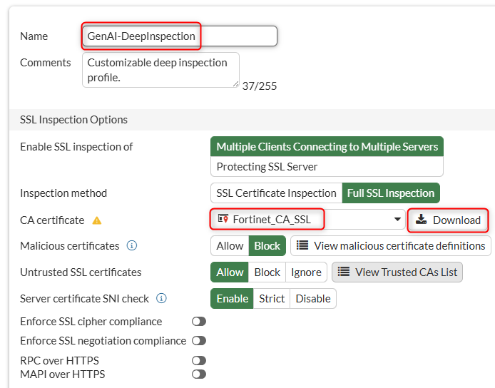{width="600"}

1. Navigate to **Security Profiles** -> **Application Control**, click on **Create New** and use the following parameters:

    - **Name:** ```GenAI-AppCtrl```
    - Ensure that the **Generative AI** category is listed and set to monitor. 

    !!! warning 

        If you do not see the Generative AI category listed, navigate to **System** -> **FortiGuard** and click on *Update licenses & definitions now* or type ```execute update-now``` in the CLI to trigger a signature update. Wait a few minutes and verify that the signatures under *Firmware, VM and base subscription* were updated.
        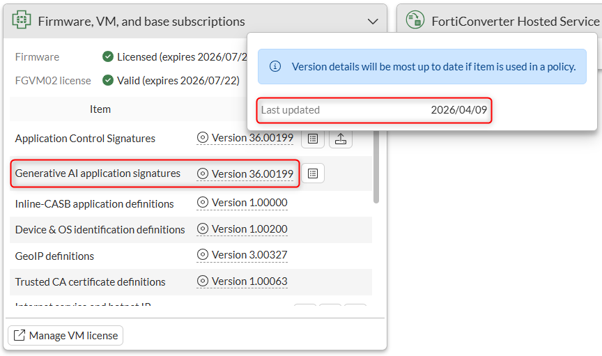{width="500"}
    
    - Click on **Create New** under **Application and Filter Overrides**
    - Use the search bar to find ```chatgpt``` and hit *enter*

    ??? tip "Tip"

        You can mouseover a specific signature to determine whether the signature requires Deep SSL Inspection. Generally, signature that provides more granular control will require Deep SSL Inspection (ie. block access to Youtube does not require SSL Inspection but blocking a specific functionality within YouTube such as Video Upload or Commenting WILL require SSL Inspection). From here you could also classify the applications as sanctioned or unsanctioned but we will show you how to do that from the Application Classification panel in the next step.

        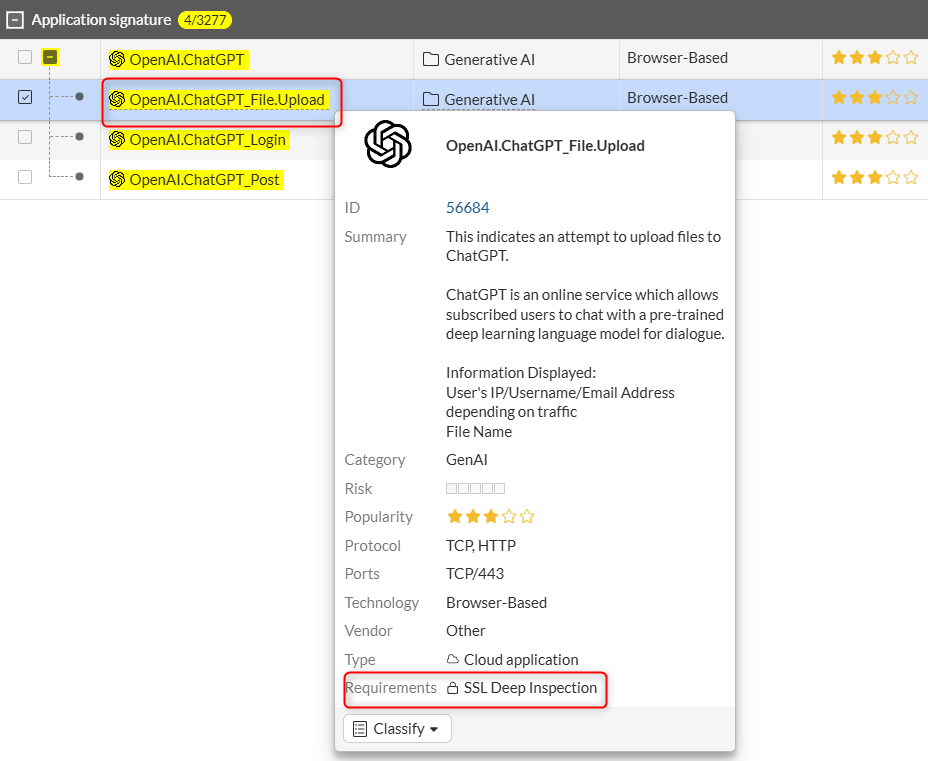{width="600"}

    - Select  *OpenAI.ChatGPT_File.Upload* from the list and click **OK**

    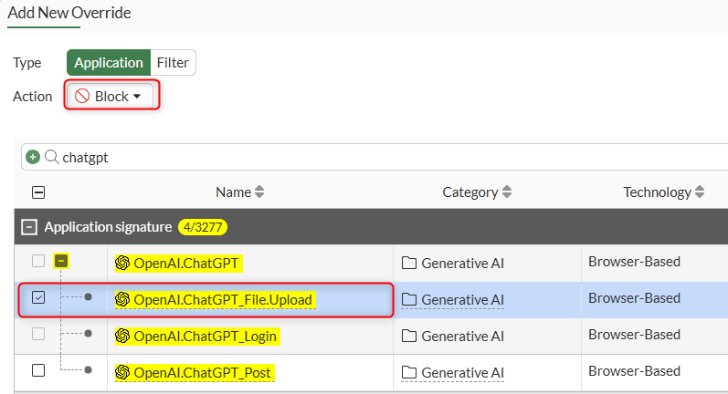{width="600"}

    - End result should like as below:

    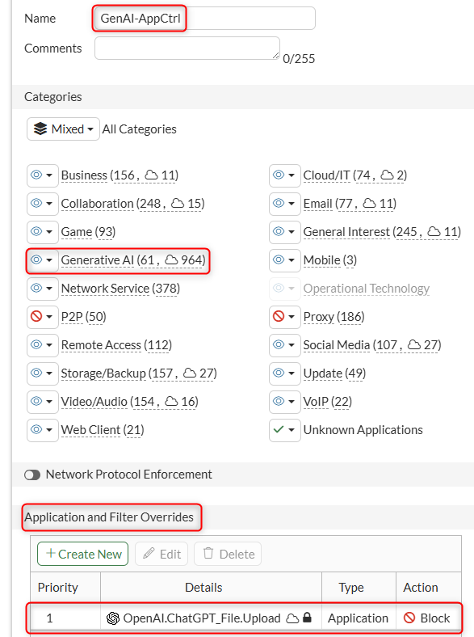{width="500"}
        
    - Click **OK** to save the new Application Control profile.

1. Navigate to **Security Profiles** -> **Application Signatures**:

    - Use the search bar to filter by *chatgpt*. Select the application shown on the list and classify them as shown on the screenshot below (by right-clicking on the application and selecting *Classify* from the contextual menu):

    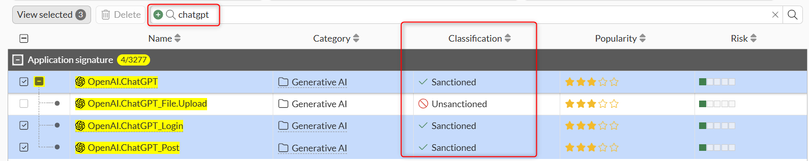{width="500"}

    !!! tip "Tip"

        A new classification framework lets administrators mark applications as sanctioned or unsanctioned by application or category. Any app not explicitly classified is automatically labeled as unclassified by default, though the implicit rule can be changed to treat them as sanctioned or unsanctioned. This provides clearer visibility in logs and improves monitoring and management of application usage.

### Configure Firewall Policy and FortiView Widgets

1. Navigate to **Policy & Objects** -> **Firewall Policy**  and Policy *DIA_OUT* and double click on it to edit it and:

    - Set **Application Control** to *GenAI-AppCtrl*

    - Set **SSL Inspection** to *GenAI-DeepInspection*

         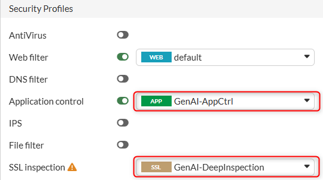

    - Click **OK** to save the changes

    - Click **OK** when prompted for confirmation. In the next steps we will import the CA certificate into the endpoint. 

    - DIA_OUT policy should like this:

        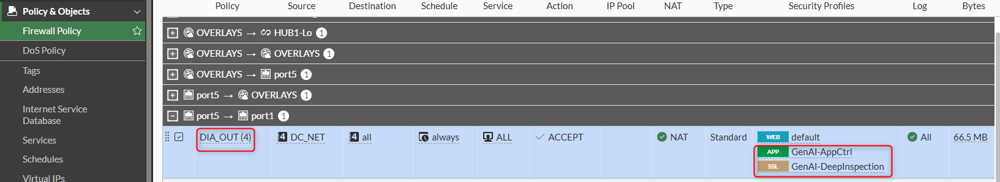

1. Open the CLI Console by clicking on the CLI icon on the top right hand side

    - Type the following commands:

    !!! code 
        ```
        config log setting
            set extended-log enable
            set extended-utm-log enable
        end
        ```

    !!! tip "Tip"
        The command above will include additional fields to different types of UTM logs, and in the case of GenAI it will include fields such as AI User, Model, DC location, Use Case, Cloud GenAI, and even the actual user prompt. 

    - Close the CLI window

1. Navigate to **Dashboard** -> **FortiView** and click on **+Add Tab** on the top right hand side of the screen. Set the following parameters:

    - **Name:** ```Generative AI```

    - **Layout type:** *Widget*

    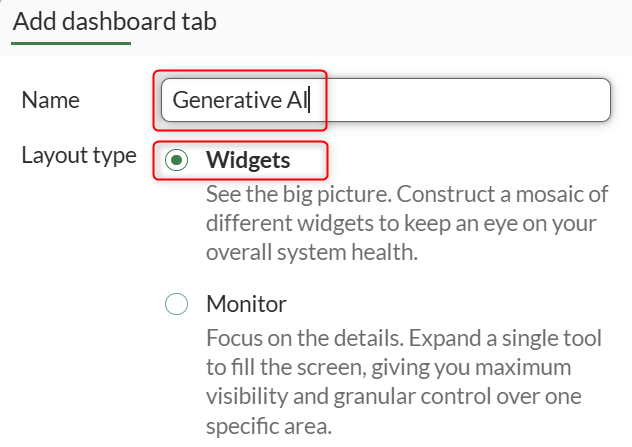{width="400"}

    - Click on **OK**

    -  Click on **Add Widgets** and add the following widgets:

        - *FortiView AI Applications* and set the following settings:
        - **Fortigate:** Hub80
        - **Data Source:** Specify and choose FortiGate
        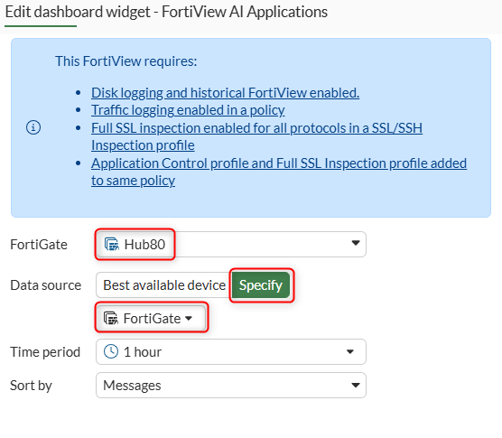{width="400"}


        - *FortiView AI Use Cases* and use the same settings as the previous Widget.
         

    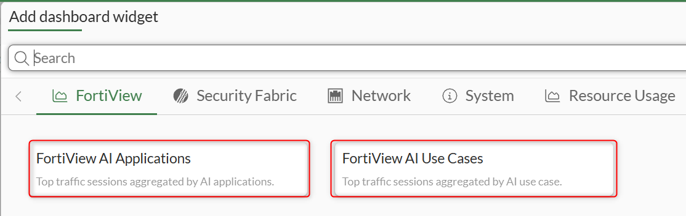{width="400"}

    - Click on **Close**

### Testing and Verification 

1. Before testing, we need to install the CA certificate in the client machine so that the firewall can decrypt the traffic without the users seeing the unsecure website warning. 

    - RDP into the internal Windows host using your instance FQDN and **port 3391**. Log in with the same credentials ```fortinet``` / ```Fortinet123#```

    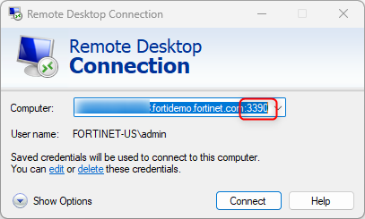

    - Copy/paste the Certificate you downloaded before into the Desktop of your RDP session, right click on it and click on **Install Certificate**

    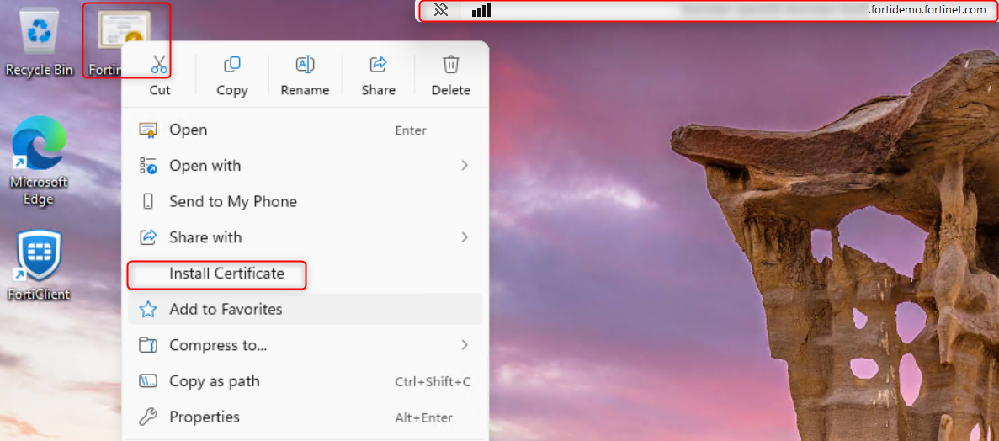{width="500"}

    - Set the **Store Location** to  *Local Machine* and click on **Next**

    - Select **Place all certificates in the following store**, click on **Browse...** then select the **Trusted root Certification Authorities** and click on **OK** then **Next**

    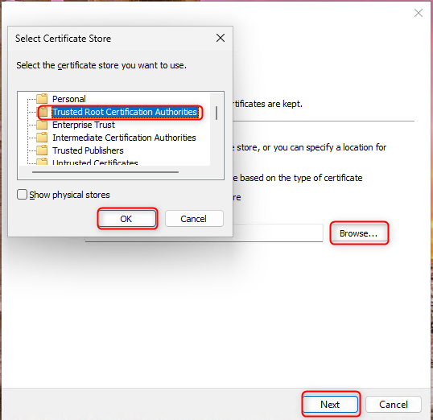

    - Finally, click on **Finish**. and then **OK** when you see the confirmation prompt.

    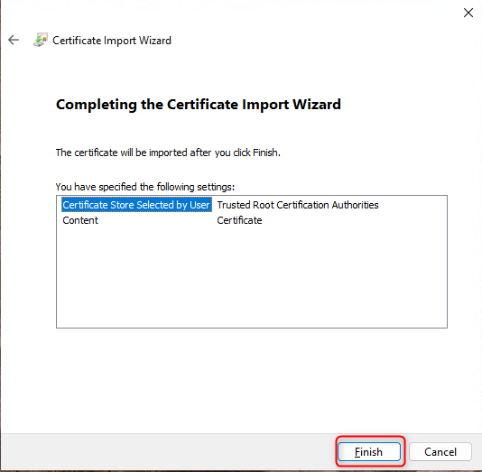

    - Open Edge web Browser and navigate to any website using https. Click on the padlock icon, then on **Connection is secure** and finally on the certificate icon:
  
    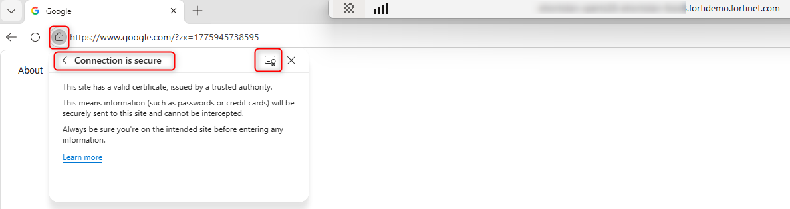

    - This will display the certificate that is presented to the web browser to secure the connection. Note that the Common Name (CN) is the FortiGate' Serial Number which is unique to each student.

    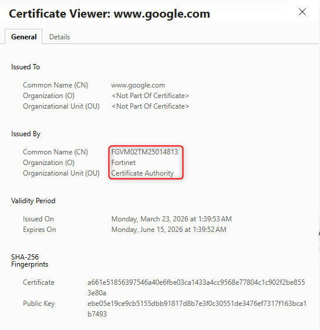

    !!! tip "Stop and Think"

        Note that certificate Issuer is Fortinet because the FortiGate is decrypting, inspecting and re-encrypting the traffic before presenting it to the end user and it's in fact signing the certificates using the built-in local CA certificate. In production networks is recommended to use enterprise PKI infrastructure.  For more information on SSL/TLS Deep Inspection be sure to explore [FortiGate Best Practices](https://docs.fortinet.com/document/fortigate/7.6.0/best-practices/598577/ssl-tls-deep-inspection){target="_blank"}

1. On the Web Browser, navigate to ChatGPT (```https://chatgpt.com```) and send multiple prompts to generate traffic logs. 

1. Upload a photo to chat GPT. Feel free to take a screenshot or save any photo from the web and use it to upload it to ChatGPT. As expected the upload will be blocked

    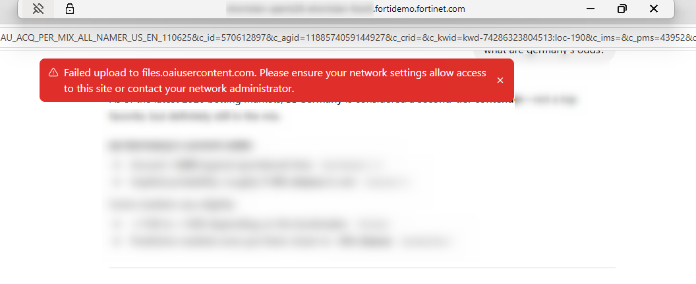

1. Submit more prompts, feel free to use any other GenAI application you prefer such as Claude, Gemini, etc. If possible login with your existing GenAI Application credentials.

1. Back on your Hub80 FortiGate, navigate to **Logs & Reports** -> **Security Events** and under *Application Control* click on **GenAI** to see the logs. 

    - Switch log source to **Disk**

    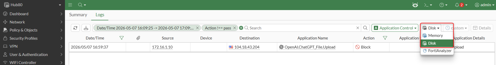


    - Remove the "pass" filter to see all App Control events including the blocked file uploads. 

    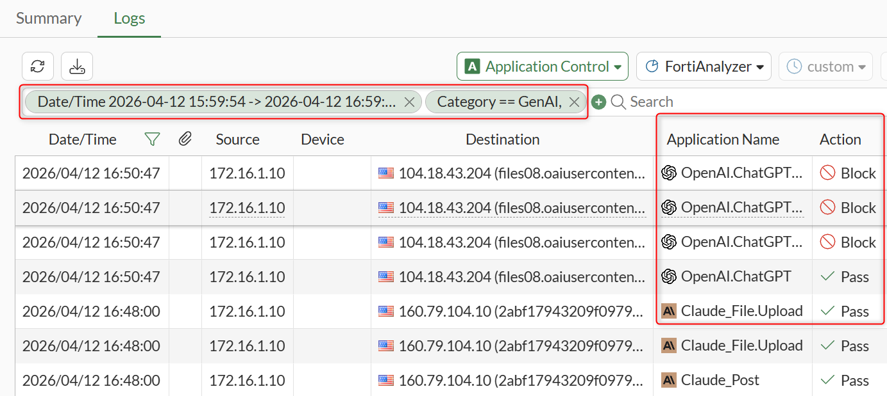


    - Feel Free to double click on the logs to see more details. For example, if you logged in with your GenAI account you should be able to see that information at the bottom of the log details.  

    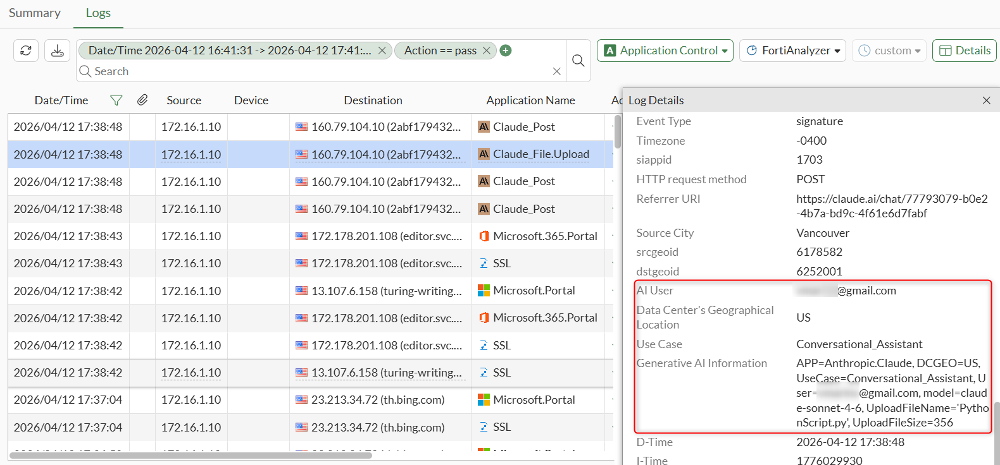

#### Working with FortiView AI Widgets

1. Navigate to **Dashboard** -> **FortiView** and click on **Generative AI** tab. Let us focus on the FortiView AI Application by Messages Widget but feel free explore the AI Use Case Widgets at the end of the lab. 

    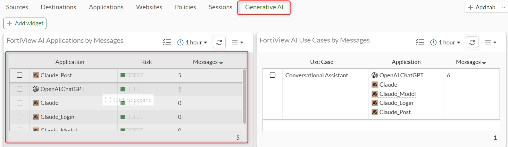

    - Mouse over the **FortiView AI Applications by Messages** and click on *Click to Expand* to see more details about the Messages. 

    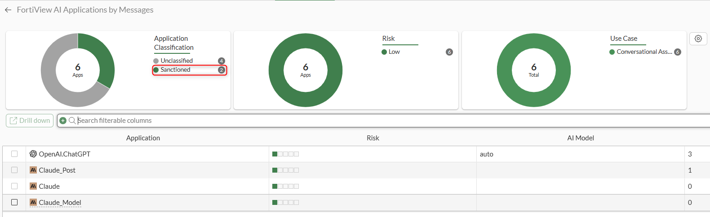

    - Focus on the **Application Classification Widgets**, click on **Sanctioned** to filter the application list by "approved" applications. 

    - Select one of the Sanctioned applications and click on **Drill Down**

    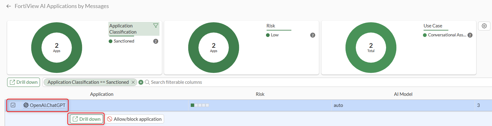

    - Click on **View session logs**. Notice anything interesting there? this is good place to see relevant and specific information about GenAI utilization in your organization. 

     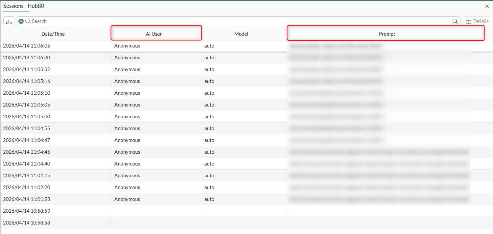


!!! warning "Read before continuing"
    You will not be able to complete the next tasks of this section because this feature was added on FortiOS 8 beta 3 but removed in GA as we wanted to re-work and improve it even more before releasing it to the public. However, we decided to keep the steps to give you an idea of what is the value and how it can simplify the operations; again just keep in mind the **Allow/Block Application** button has been removed in the GA version. 

Now, Let's say ACME Corp allows users to use ChatGPT as long as they are not uploading files to the chat bot. You as the administrator notice users are leveraging other GenAI applications such as Claude (or the one you used during your tests) and now we need to do something about it. 

1. Within **FortiView AI Application by Messages**, filter by *Unclassified* Applications, select the non-ChatGPT application (Claude in this case) and click on **Allow/Block Application**

    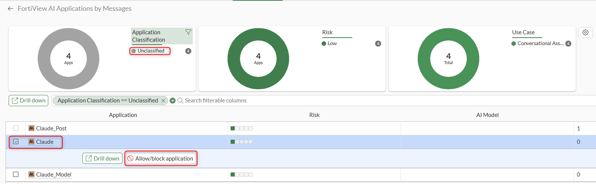

    - Review the the list of applications that will be blocked and the policy that is using the application control profile and click on **Next**

    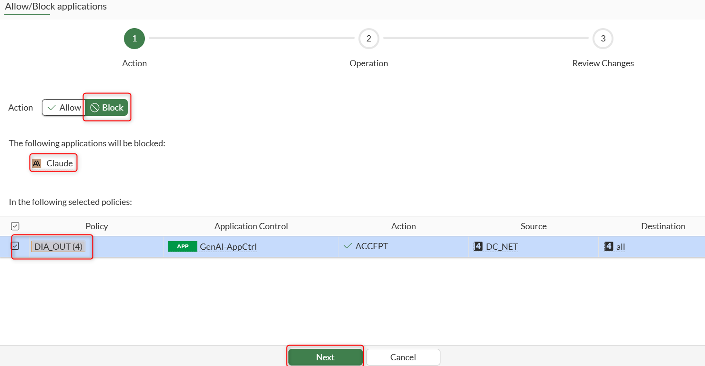

    - Set the applications overrides to be *Apply to the application profile directly* and click on **Next**

    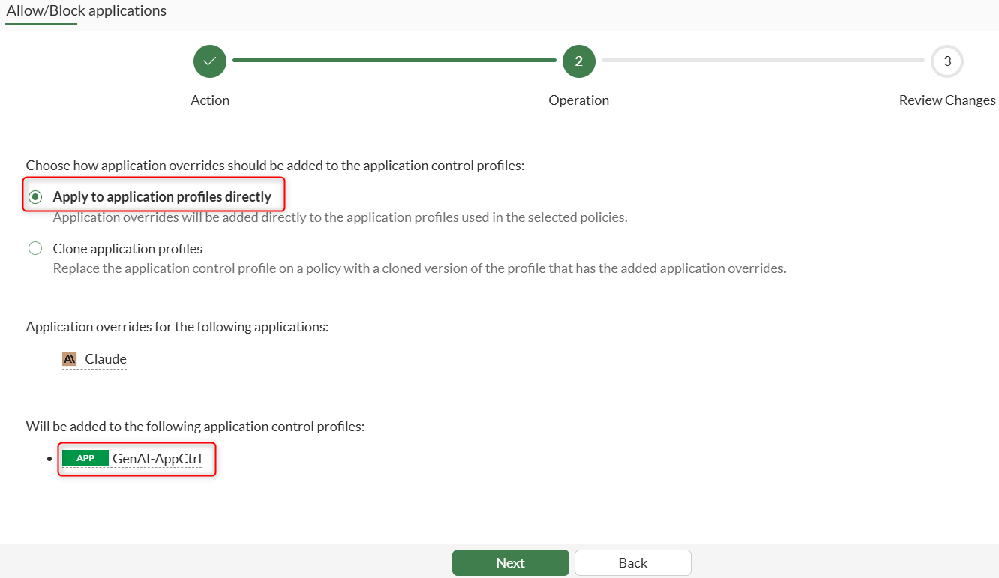

    - Finally click on **Submit**

    !!! tip "Tip"

        Note that while this was a very basic example, if you had multiple unsanctioned/unclassified GenAI applications that needed to be blocked, you could have selected all of them (either with Ctrl+click or by using the checkbox) and the wizard would have listed all the different application control profiles and policies that were hit by the unsanctioned GenAI applications and apply the changes automatically.

    - Navigate to **Security Profiles** -> **Application Control** and double-click on *GenAI-AppCtrl* to edit it to confirm that the application override for *Claude* has been added to application Override list.

    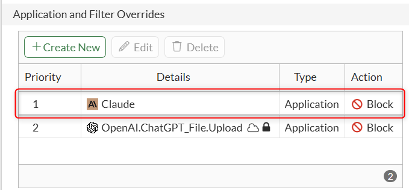{width="400"}

1. Go back to your RDP Session, find your Claude session in the web browser and hit the refresh button. You should see a block page from the FortiGate.     

    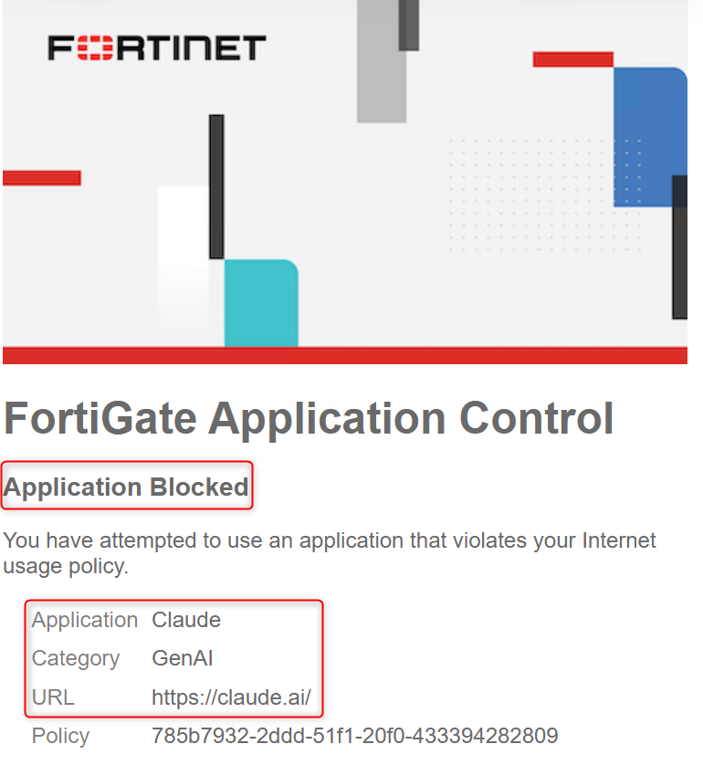{width="400"}

1. (Optional) Feel free to go back to **Hub80** FortiGate and explore the Application Control Logs.

## Use Case: Securing SaaS Applications

| Info | Result |
| ---- | ---- |
| Time to Complete | 45 Minutes |
| Dependencies | N/A |
| About | Another new feature added to the Security Profiles is the Enhanced inline CASB: First we added support to over 2,800 SaaS applications out of the box (plus you can create your custom SaaS applications); and second, the inline CASB security profile has been enhanced to support control factors, such as tenant information, in JSON data exchanged between a web browser and a custom SaaS application. In this Lab, students will configure inline CASB to support those uses cases where organizations allow use of a specific SaaS application but they want to make sure they only use it with corporate accounts.|

### Configuring Inline-CASB Profile

1. Navigate to **System** -> **Feature Visibility**, toggle-on *Inline-CASB* and click on **Apply**

1. Navigate to **Security Profiles** -> **Inline-CASB** and click on **SaaS Application** Tab. 

    - Note the number of out of the box entries at the bottom of the page and that they are managed by FortiGuard. You can use the search bar to filter by a specific application your organization might be using. 

    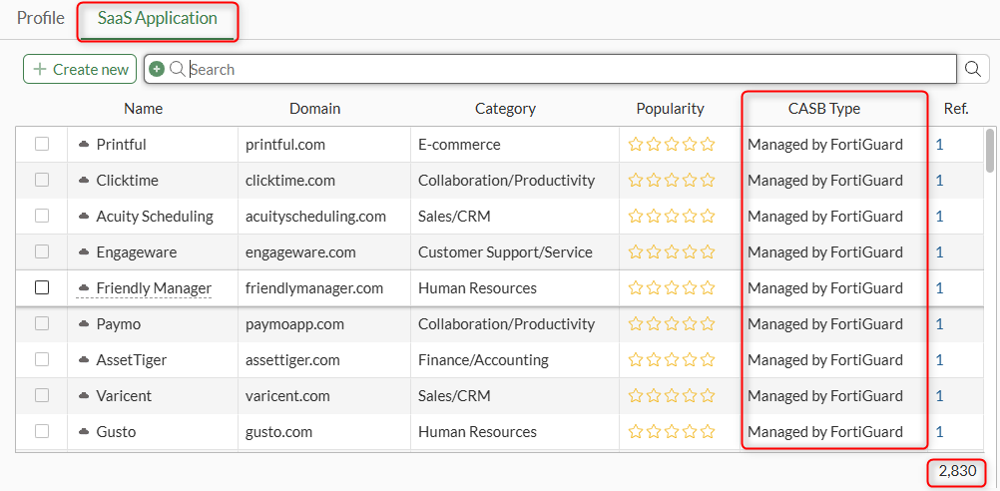{width="500"}

    !!! tip "Tip"

        Administrators can customize their own SaaS applications, matching conditions, and custom controls and actions. To effectively create a custom SaaS application signature, administrators need to understand the pre-requisites and how that SaaS Application work. This information can typically be found in the SaaS provider documentation.

        Also note that this feature is not supported on FortiGate models with 2 GB RAM or less. See [Proxy-related features not supported on FortiGate 2 GB RAM models](https://docs.fortinet.com/document/fortigate/7.6.6/administration-guide/519079/proxy-related-features-not-supported-on-fortigate-2-gb-ram-models){target="_blank"} for more information.

1. Go back to the **Profile** Tab, click on **Create New** and use the following settings:

    - **Name:** ```SaaS-Microsoft```

    - Under *SaaS Applications* click on **Create New**

    - Use the search bar to filter then select *Microsoft* and hit **Next**

    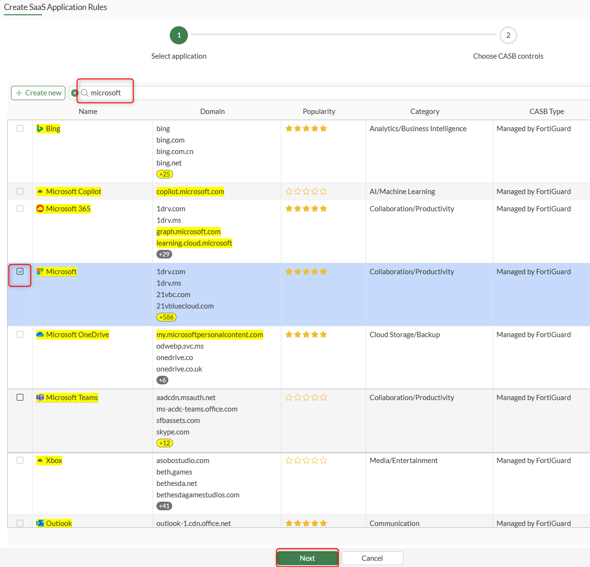{width="500"}

    - Toggle-On **Tenant Control** and type use any other domain such as ```acme.com```. If your company does have a Microsoft account you feel free to use any other SaaS application you use in your organization. 

    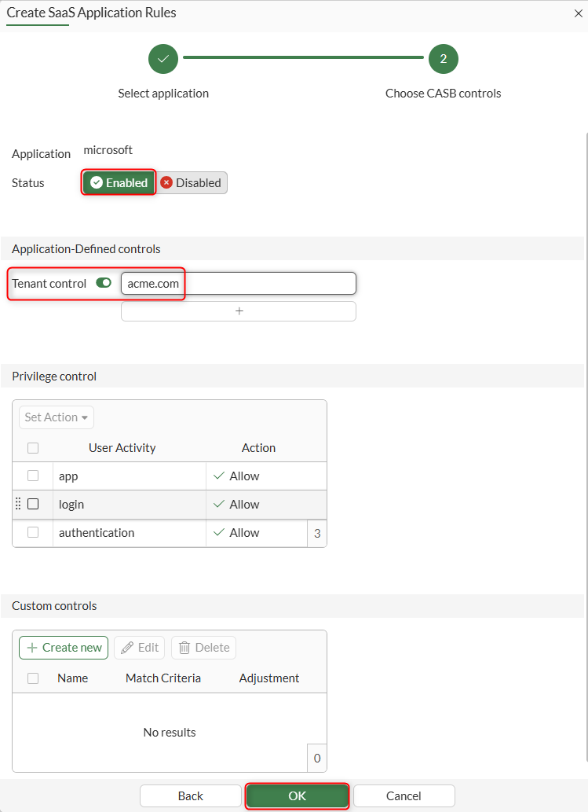{width="500"}

    - Click **OK** to save the *SaaS Application Rule*

    - End result should look like this:

    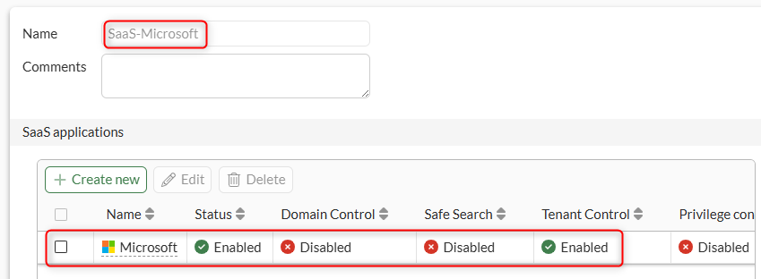{width="500"}

    - Click **OK** to save the new CASB profile

### Applying CASB Profile

1. Navigate to **Policy & Objects** -> **Firewall Policy**:

    - Find Policy ID 4 *DIA_OUT*, double-click on it to edit it and set the following parameters:

    -  **Inspection mode:** *Proxy-based*

    - Under Security Profiles, toggle Inline-CASB on and select *SaaS-Microsoft*

    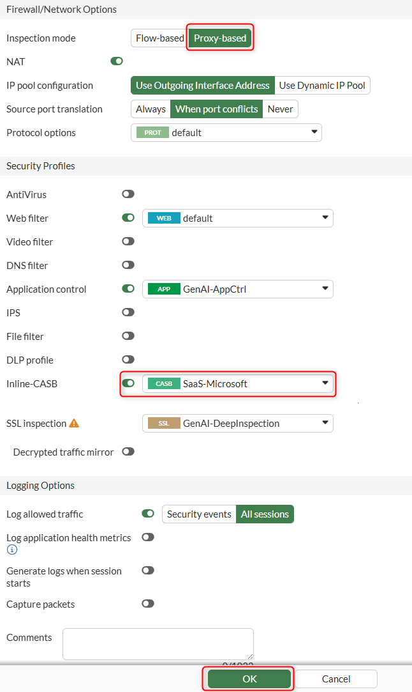{width="500"}

    - Click **OK** to accept the changes

    !!! warning "Warning"
        If your company does not have a microsoft 365 account feel free to add any other SaaS application your company may use. In the example below we added Google for those companies that use Google Workspace instead. 
        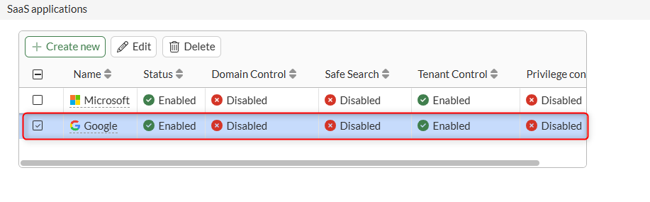{width="500"}


    !!! tip "Tip"

        Inline-CASB is a proxy-base inspection feature which means it can only be used in firewall policies set to proxy-based inspection mode. Note that proxy-based inspection is not offloaded to ASICs.

### Testing and Verification

1. RDP into your internal host using your instance FQDN and **port 3391** and browse to ```www.microsoft.com```. You can also use the bookmarks bar.

!!! warning "Warning"
    Do not use your personal account for testing tenant control because that is restricted using a custom header. If you like to test this functionality feel free to do the optional task below.

- Click on the **Sign-in** button on the top-right hand side of the page and ***use your company account*** to sign in. Login should fail as the tenant control feature only allows the domain *acme.com*. 
    
    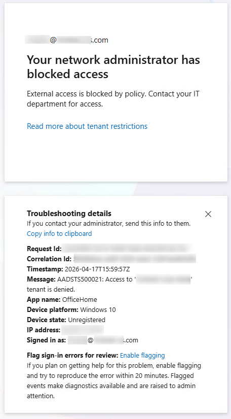{width="400"}
  

2. (Optional) If you organization has Microfost 365, feel free to go back to **Hub80**, edit the CASB profile to allow your company domain and repeat the test. 

### (Optional Task) Blocking Personal Accounts

1. Back in our Internal RDP host, test again login into ```office.com``` but this time use your personal account. The login should be successful.

    - Logout of of the portal.

1. Back on FortiGate *Hub80*, navigate to **Security Profiles** -> **Inline-CASB**, double-click on *SaaS-Microsoft* to edit the profile:

    - Under **SaaS Applications**, double-click on *Microsoft* to edit it.

    - Under **Custom Controls**, click on **Create New** and use the following parameters:

        - **Name:** ```block_personal_account```

        - **Apply when HTTP packet matches:** *Any of the following*

        - **URL Domain:** :white_check_mark: ```login.live.com```   

        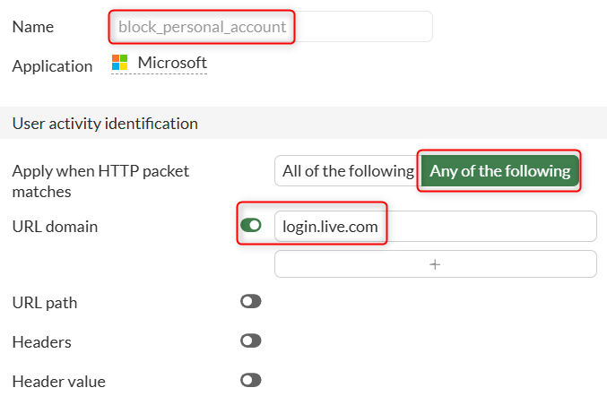{width="400"}

        - Under **Application-Defined controls**, Click on **Create New** and use the following parameters:

            - **Name:** ```block_personal```

            - **Action:** *Create Header*

            - **Header Name:** ```sec-Restrict-Tenant-Access-Policy```

            - **Header Value:** ```restrict-msa```

            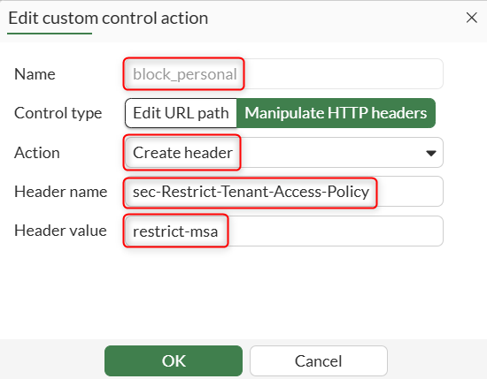{width="400"}

            - Click **OK** to save the custom application control

            - Click **OK** again to save the edits to the *SaaS Application Rules*

            - Click **OK** one last time to save the edits to the Inline-CASB profile. 

At this point we have update the inline-CASB profile that is already applied to the security policy so the only thing left to do is test again using the personal credentials

1. Go back to your internal RDP host, browse to ```www.office.com``` and click on login. Make sure to use a private window or that you logged out before to clear the session. This time it should fail because of the custom SaaS application controls we configured in the previous step.

    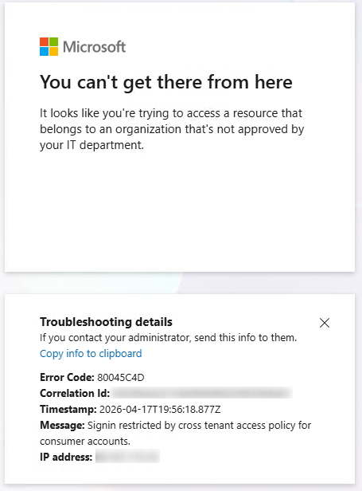

<<<<<<< HEAD
1. (Optional) Feel free to go back to Hub80 FortiGate and explore the Inline-CASB logs. 

!!! success "Lab Completed"
    You have successfully implemented the new features of inline-CASB profiles and guardrails to protect against shadow GenAI applications.
=======
1. (Optional) Feel free to go back to Hub80 FortiGate and explore the Inline-CASB logs. 
>>>>>>> 5eb1eda8b42c69c487591c02b5cd44fa6056fab0
