# FortiOS 8.0 ZTNA

## Use Case: Simplified ZTNA Configuration

| Info | Result |
| ---- | ---- |
| Time to Complete | 45 Minutes |
| Dependencies | N/A |
|About | FortiOS 8.0.0 introduces various configuration simplifications and modularization. Various objects are decoupled so they can be paired together in different combinations within the ZTNA policy. In this lab, Hub80 will be the ZTNA proxy gateway, and EMS behind FortiSASE will be our Proxy Policy Enforcer. You will use the external Windows 11 client to access private applications behind Hub80. |

### Connecting Hub80 to FortiSASE

Before configuring ZTNA policies and applications, we need to complete the initial configuration. Note that if this is preconfigured in your environment, ensure that the connector is up and the SASE certificate has been verified. If the certificate shows as unverified you can disable the connected and re-enabled it again to get the certificate authorization request. 


1. Log into **Hub80** and navigate to **Security Fabric** -> **Fabric Connectors**

    - Double-click on **FortiClient EMS** 

    - Toggle EMS1 status to **Enabled** and use the following parameters:

        - **Type:** *FortiClient EMS Cloud*

        - **Name:** ```SASE```

    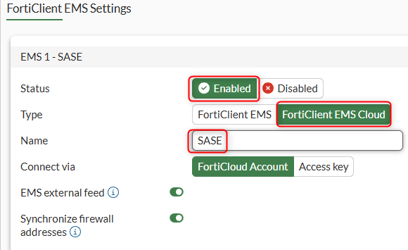

    - Click **OK** to save the changes    

    - Click **Accept** to verify the EMS Server Certificate

    - Click on **Close**

1. Open **FortiSASE** console using your Lab dashboard

    - Navigate to **Security** -> **ZTNA** and click on **Connectors** Tab.

    - Select your Hub80 FortiGate (verify that the serial number matches your Hub80's serial number) and click on **Authorize**.

    - Click **OK** to confirm the action.

    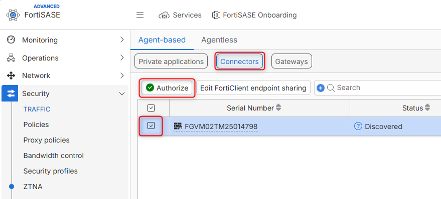

1. Now that you have authorized the FortiGate, go back to **Hub80** and navigate to **System** -> **Feature Visibility**:

    - Toggle on :white_check_mark: *Zero Trust Network Access*

    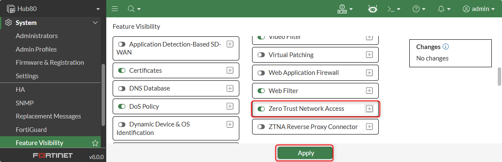

    - Click on **Apply**.
1. Navitate to **Policy & Objects** -> **ZTNA**

    - Click on **Security Posture Tags** tab and validate that FortiSASE is synchronizing the tags to Hub80 under *Security Posture IP Tag*

    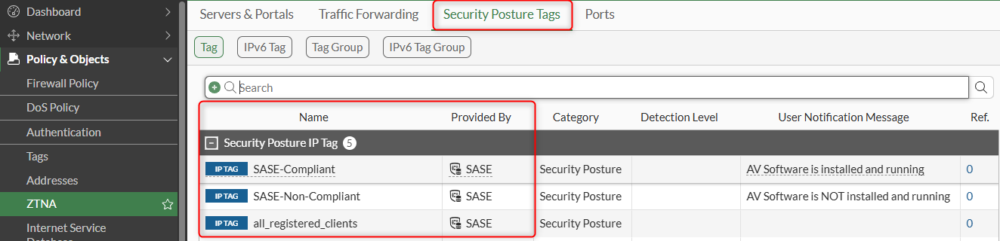

1. Go to [Workshop 3 Lab 4 ZTNA HTTPS Access Proxy Configuration](../workshop_03/sase_04_01.md#ztna-https-access-proxy-configuration){target="_blank"} and follow step 1 to step 8 to import the xperts26.com wildcard certificate  into **Hub80**. Remember this will be done in **Hub80** this time.

    - End result should look as shown below:

    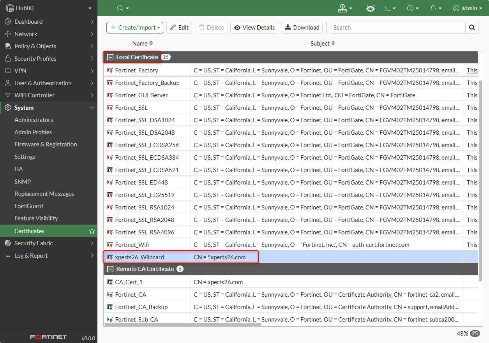

1. Finally, open the CLI tab in **Hub80** and paste the following script:

    ```
    config system dns-database
        edit "xperts26.com"
            set domain "xperts26.com"
            config dns-entry
                edit 1
                    set hostname "fmg80"
                    set ip 10.254.1.28
                next
                edit 2
                    set hostname "branch80"
                    set ip 10.6.1.2
                next
            end
        next
    end
    ```
    !!! tip "Good to Know"
        The script above basically creates DNS entries so that the FortiGate can resolve the FQDN to the real server IP. In real environments, typically the FortiGate will be connected to an enterprise DNS server that can provide this functionality.  

    Now that we have completed the pre-requisites to use ZTNA, let's continue with the actual ZTNA configuration

### Configuring ZTNA Objects

#### Configuring Traffic Forwarding Server 

Traffic Forwarding Servers is the new way of configuring Non-Web ZTNA Applications, meaning TCP and UDP applications that are NOT HTTP/HTTPS. Prior to FortiOS 8, these were known as "TFAP"

1. Still within **Hub80**, navigate to **Policy & Objects** -> **ZTNA**, click on the **Ports** tab then on **Create New** and use the following settings:

    - **Name**: ```MyZTNA_Port```

    - **Interface:** *port1*

    - **Port:** ```9443```

    - **Default certificate:** *xperts26_wildcard*

    - Click **OK** to save the changes

    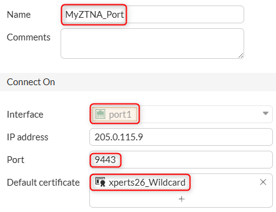

1. Still on **ZTNA** section within **Hub80**, click on the **Traffic Forwarding** tab then on **Destination**. Finally click on **Create new** and use the following settings:

    - **Name**: ```MyRDP```

    - **Type:** *On-premise*

    - **Address:** Click on the + Sign to create a new Address Object. Use the following settings:
        - **Name:** ```WinInternal```
        - **Type:** *Subnet*
        - **IP/Netmask:** ```172.16.1.10/32```
        - Click **OK**
        - Click **OK** again to select the new entry
    - **Port:** ```3389```

    - **Protocol:** *TCP*

    - Click **OK** to save the changes

    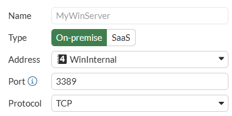

    !!! bug "Important"

        There's a bug in the GUI that prevents you from adding multiple port ranges (say if you wanted to map ports "3389, 445"); the GUI will indicate that you have typed an invalid port or port range but you can still configure multiple ports via the CLI

1. Right-click on the newly created ZTNA Destination and click on **Edit**

    - Click on **>_ Edit in CLI** option on the right hand side of the panel.

    - Type the following command:

    ```
          set mappedport 3389 445 
        next
    end
    ```

    - Close the CLI window and verify that the GUI now shows ports 3389 and 445 mapped to the ZTNA Destination.

    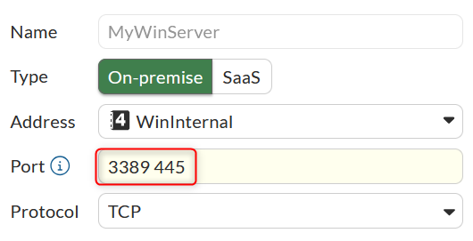

    - Click on **Cancel** (the bug will not allow you to click on OK)

1. Still on **Traffic Forwarding** tab, click on **Traffic Forwarding Server** sub tab, click on **Create new** and use the following settings:

    - **Name:** ```TCP Forwarding Server```

    - **Host:** ```205.0.115.9```

    - **Connects on:** click **Use existing** and select *MyZTNA_Port*

    - Click **OK** to save the changes

    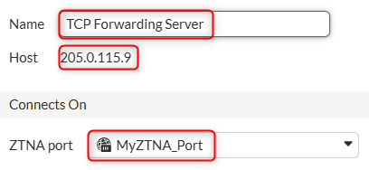

#### Configuring ZTNA Web Applications

1. Still on **ZTNA**, Click on **Servers & Portals**, then under **Web Server** tab click on **Create new**  and use the following settings:

    - **Name:** ```Branch80_ZTNA```

    - **Host:** ```branch80.xperts26.com```

    - **ZTNA Ports:** *MyZTNA_Port*

    - **Internal server IP:** *DNS default**

    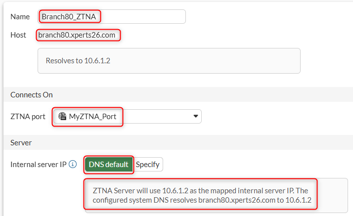

    Notice how the FortiGate is resolving the virtual host to the private IP of the web server. 

    Host (aka Virtual Host) fields are mandatory, since multiple entries can be paired with the same ZTNA Port. To differentiate between different servers, the virtual host field is used as matching criteria.

    Feel free to explore the DNS Server configuration of **Hub80** by navigating to **Network** -> **DNS Server** to see what this configuration looks like. If this Menu is not visible, where could we go to enable configuration menus in the GUI?

    !!! tip "Best Practice"

        As a best practice, an external DNS should be used by remote clients to resolve the virtual-host to the ZTNA Port. In our case, we have pre-configured the required DNS entries so that requests from the external windows endpoint going to branch80.xperts26.com will resolve to the public IP Hub80 (209.0.115.9) which is the interface configured in our ZTNA Port.

    - Click on **OK**

1. Repeat the step above to create a new Web Server using the following settings:

    - **Name:**  ```FMG80_ZTNA```

    - **Host:** ```fmg80.xperts26.com```

    - **ZTNA Ports:** *MyZTNA_Port*

    - **Internal server IP:** *DNS default*

    - Click on **OK**

1. End ZTNA Web Server configuration should look as shown below:

    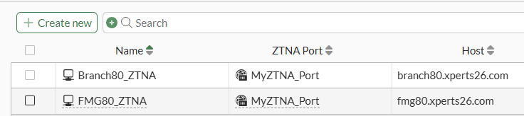

### Configuring ZTNA Policies

1. Navigate to **Policy & Objects** -> **Firewall Policies**, click on **Create new** and use the following settings:

    - **Name:** ```ZTNA```

    - **Type:** *ZTNA*

    - **Incoming Interface:** *port1*

    - **Source:** *all*

    - **Security posture tag:** *IP TAG SASE-Compliant*

    - **ZTNA port:** *MyZTNA_Port*

    - **Log allowed traffic:** *All sessions*

    - Click **OK** to save the changes

    !!! tip "Good to Know"

        ZTNA traffic policies can be configured using the ZTNA firewall policy, or a ZTNA proxy policy. 
        
        The difference is ZTNA firewall policy simplifies the config so specifying a ZTNA port will automatically allow all web-proxy associated with it. Also, all traffic forwarding servers are added.
        
        ZTNA proxy policy allows more granularity for controlling the exact ZTNA server and ZTNA destination you wish to allow. Adding a traffic forwarding destination also triggers this destination to be synchronized to the EMS ZTNA Application Catalog. 
        
    !!! tip "Tip"

        Note that we could also apply security profiles to ZTNA Policies (whether firewall or proxy). This is a key differentiator compared to other vendors as Fortinet ZTNA not only implements zero trust principles to provide connectivity but it can also decrypt and inspect sessions and apply IPS, AV, DLP, etc. 

    ??? info "Want to know more?"

        To configure a "proxy policy" in the GUI,  toggle on :white_check_mark: *Explicit Proxy* under feature visibility. 

        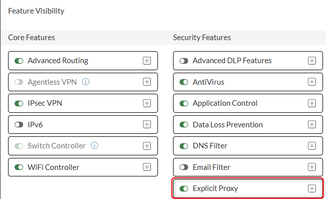{width="400"}

        then an example of an explicit ZTNA policy would look like this. 
        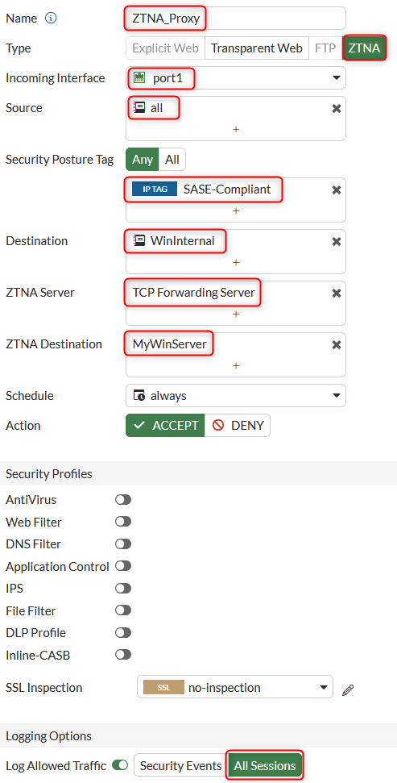{width="400"}

        Notice how in the screenshot above, we can define specific ZTNA Destinations (TCP or UDP applications) instead of ALL destination servers. In General, if granular control is needed then you will work with ZTNA Proxy Policies. 

    At this point, we have configured ZTNA Objects and policies, now is time to configure the settings that will be pushed down to the endpoints so they know how to access the ZTNA applications.

### Updating FortiSASE EndPoint Profile

1. Go back to FortiSASE console and navigate to **Endpoint management**

    - Select *Default* **or** *Xperts26* (if you completed the SASE Lab) endpoint profile and click on **Edit**

    - Go to **ZTNA** tab, under *Connection Rules* click on **+ Create** and use the following settings:

        - Under **Agent-based ZTNA application:** *172.16.1.10/255.255.255.255:3389,445*

        - Click **OK** to create the connection rule

        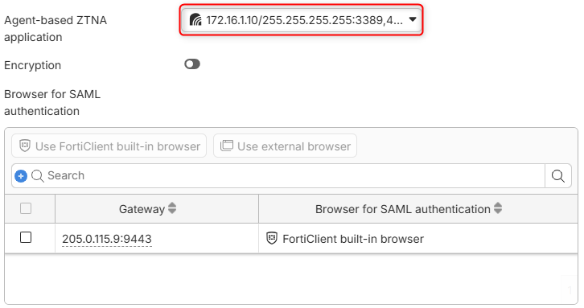

        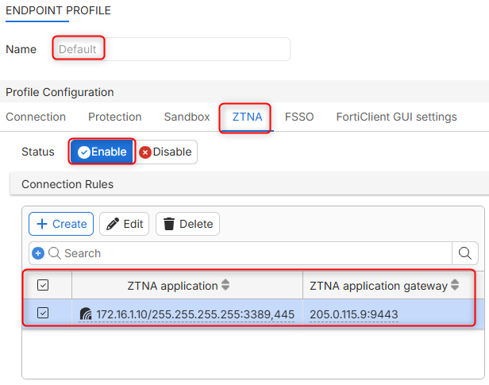

        - Go to on **FortiClient GUI settings** tab and toggle on :white_check_mark: **ZTNA Destination** under *Show features on FortiClient* 
        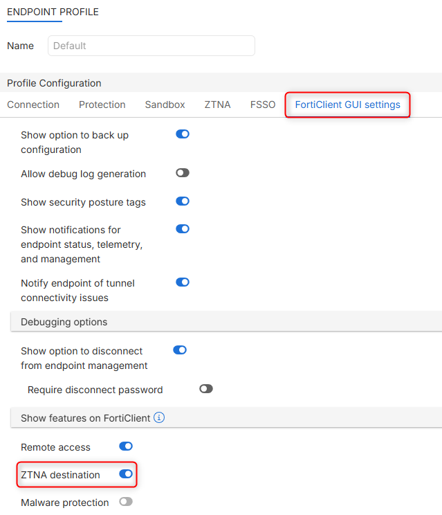{width="400"}

        - Click **OK** again to save the changes to the endpoint profile.

    We are now ready to test our configuration.

### Testing and Verification

!!! warning "Read Before Continuing"
    Before starting the verification steps, we need to onboard the *external windows endpoint* (**win-cli1-site1**) into ForitSASE. If you have not done so in previous labs, please go to [Workshop 3 Lab 1 Onboarding](../workshop_03/sase_01_03.md){target="_blank"} and onboard the endpoint so that FortiSASE can share telemetry information and ZTNA applications (Stop at Step 5).
1. On FortiSASE Console, navigate to **Endpoint Management** -> **Endpoint Profile**, modify the profile used by your external endpoint (either xperts26 or default just make sure it's the profile used by your external endpoint). 
1. We also need to import the xperts26.com CA certificate so that the endpoint can trust the certificate chain provided by the ZTNA Port (so that users do not see the unsecure website warning when accessing ZTNA Web apps). 

Download the CA certificate from [here](../images/sase/lab04/xperts26.com_CA.crt) and Import it into the External Windows RDP host certificate store (under Trusted Root Certificate Authorities) following step 1 in [this section](../workshop_05/03_fos8_profiles.md#testing-and-verification){target="_blank"}. Remember this time you are importing the Xperts26.com CA root certificate.

#### ZTNA Destinations

First, let us test the ZTNA Destinations (formerly known as TFAP).

1. RDP into your external windows endpoint, open FortiClient and go to the **ZTNA Destination** Tab

    - Notice that FortiSASE already shared the ZTNA applications that were added to the endpoint profile. You can tell by the EMS icon to the right of the ZTNA destination entry. 

    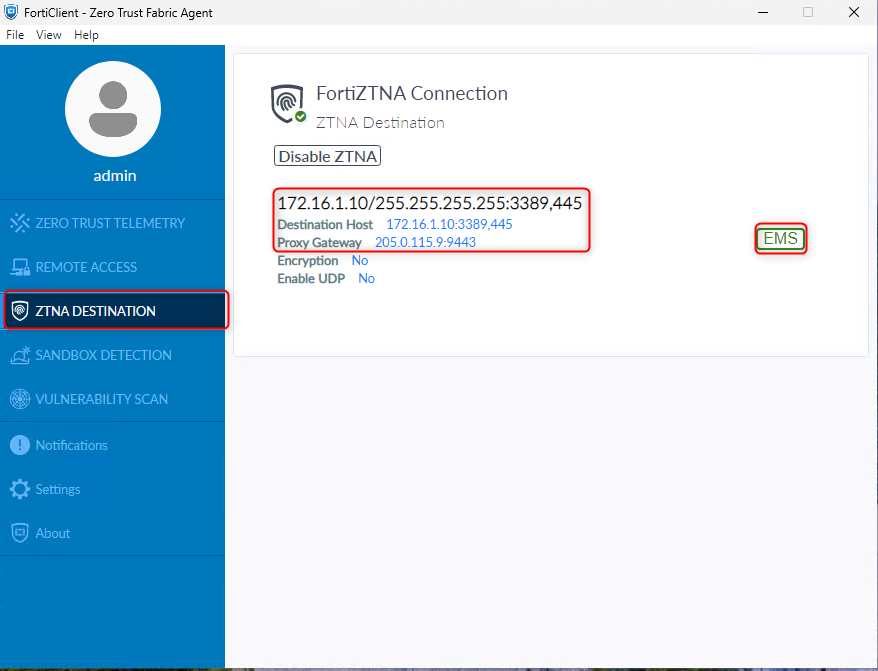{width="400"}

1. Within your external windows endpoint, RDP to your internal windows endpoint behind **Hub80**. Use the internal IP address ```172.16.1.10```. If you see the login prompt you can consider the test successful. 

    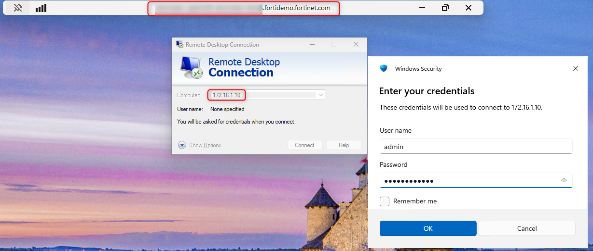{width="400"}

1. Navigate to **Log & Report** -> **ZTNA Traffic**

    - Find the related logs. If there are  entries from the internet feel free to filter by source IP ```100.64.4.1```

    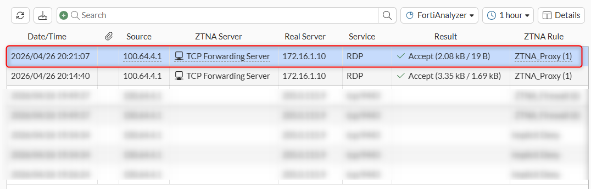

    - Double click on it to see more details.

    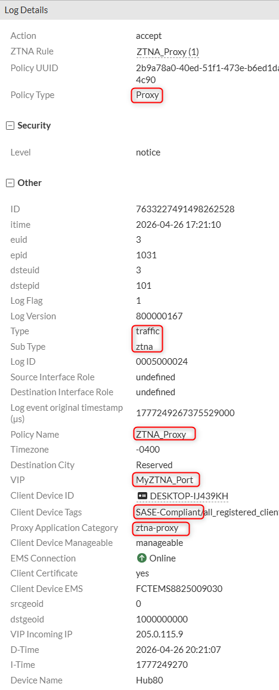

#### ZTNA Web Servers

Next, let us test the ZTNA Web applications:

1. Still in your External Windows RDP Server, open the web browser and navigate to ```https://branch80.xperts26.com:9443/```

1. Select the certificate and hit **OK** 

    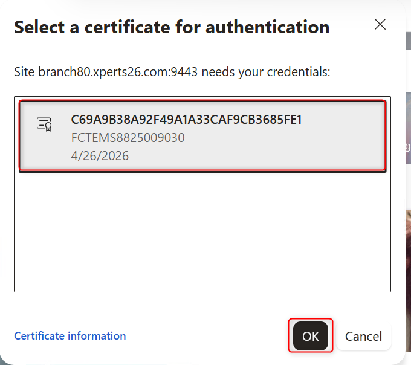{width="400"}

1. (Optional) Feel free to test the second ZTNA web server by browsing to ```https://fmg80.xperts26.com:9443/``` from the external windows RDP host.

1. Check again the ZTNA Traffic logs and find your related logs.

    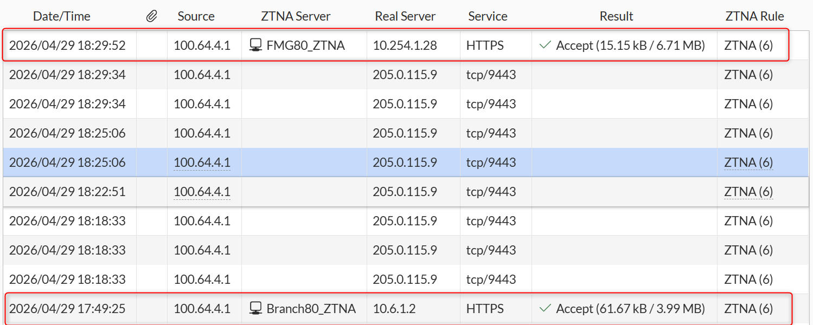

#### Posture Check

Now let us test the replacement messages that users can get when a policy is not matched because of the posture tags.

1. Back in the external Windows endpoint:

    - Click on the Windows Security icon in the system tray. 

    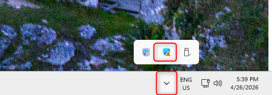

    - Click on **Virus & Threat Protection** and then **Manage Settings** under *Virus & threat protection settings*

    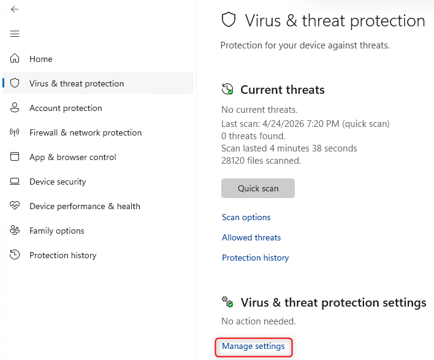{width="500"}

    - Toggle-off **Real-Time Protection**

    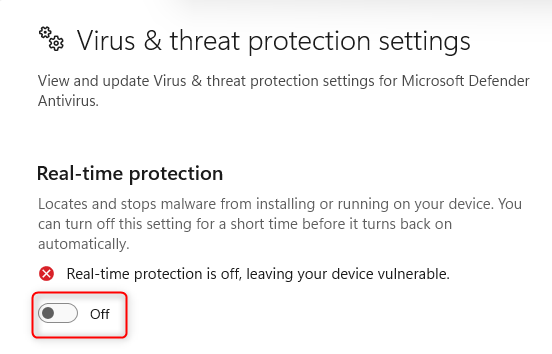{width="500"}

    - Now that Windows Defender is NOT running, we should no longer be *SASE-Compliant*. You can verify this in your FortiClient agent:

    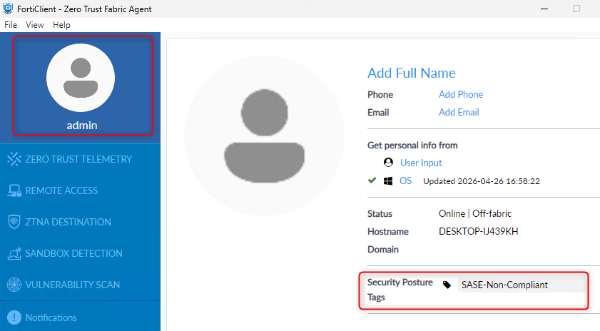{width="500"}

    - Test again accessing your RDP host using the internal ip address ```172.16.1.10```. The test should fail but more importantly notice that FortiOS 8 can provide more context on why it failed:

    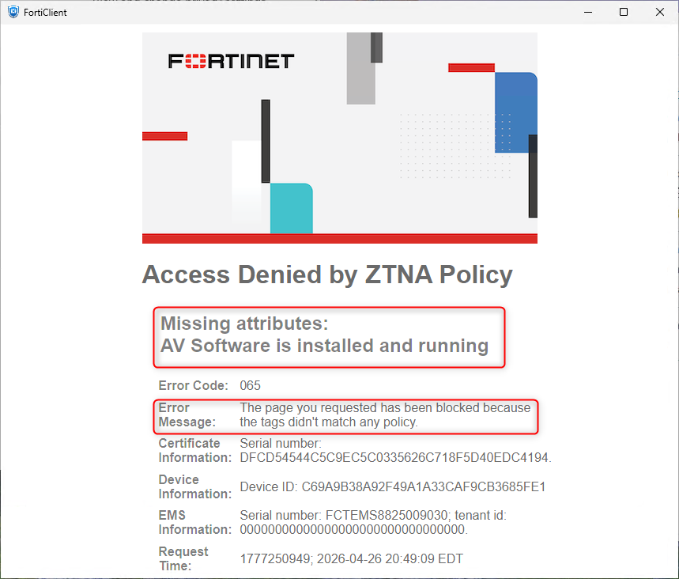{width="500"}

1. Finally, go to **fmg1-v8** GUI using your FNDN dashboard. Navigate to **FortiView** -> **Traffic Analysis** and click on the **ZTNA** Tab

    - Feel free to explore the different widgets. Your ZTNA dashboard will look different depending on how many ZTNA tests you performed but 

    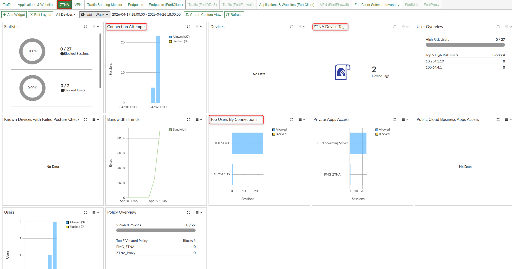

    !!! warning "Warning"
        If the ZTNA Tab is disabled under Traffic Analysis in FortiManager, then follow this step from **faz1-v8**. We are currently investigating this behavior. 

    !!! success "Lab Completed"
        You have successfully implemented the simplified ZTNA configuration