# FortiManager 8.0

## Use Case: FortiManager 8.0 New Features

| Info | Result |
| ---- | ---- |
| Time to Complete | 15 Minutes |
| Dependencies | N/A |
| About | In this lab we will explore the new feature to schedule recurring policy package installs on FortiManager 8.0 |

### Lab preparation for FMG

???+ info

    We have pre-configured the environment for you, so let's do a factory reset and register the FortiGate's to FortiManager so we can later install the pre-configure SD-WAN Overlay Template and Firewall Policy.

1. Open **A3_toolhost** web page

1. Click on **FortiOS 8.0 Lab Tools**

1. Click on **Prepare FOSv8 for FMG** and wait for the process to finish

## Use Case: Recurring Policy Package Installation

1. Open **fmg1-v8** and navigate to Device Manager -> Devices & Groups

1. Check that both devices are online

    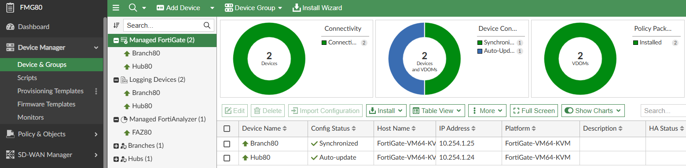{ width="600" }

1. Click on Install Wizard, select the option Install Policy Package & Device Settings and activate Schedule Install:

    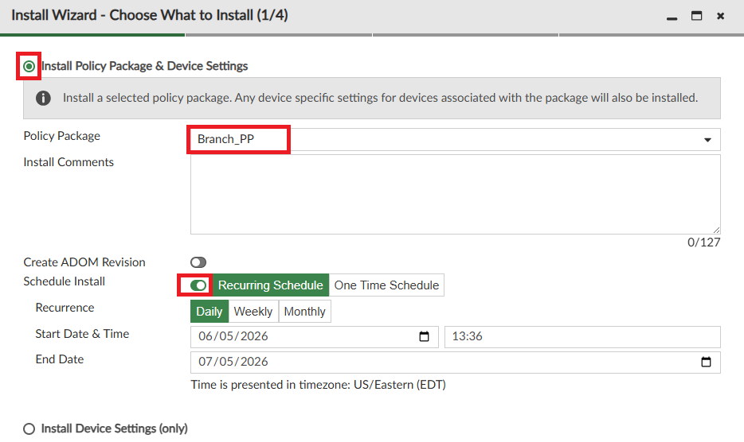{ width="600" }

    ???+ info

        Notice that FMG 8.0 now supports 2 modes for Schedule:  

        - One Time Schedule: The only option available on 7.6  

        - Recurring Schedule: The new option introduced on 8.0  

        A recurring policy install can be useful for organizations that want to allow administrators to stage changes and have an automated install every day or week at a fixed maintenance window.
        Another useful use case is to ensure that the policy in the device is in compliance with the package on FortiManager.

1. Set the date for today and the time for some minutes in the future, FortiManager will let you know if the schedule is invalid due to not enough time to complete the setup

    ???+ info

        If the end date is left blank, the schedule will run indefinitely

1. Proceed until the end of the Wizard and click on Schedule Install to setup the schedule

    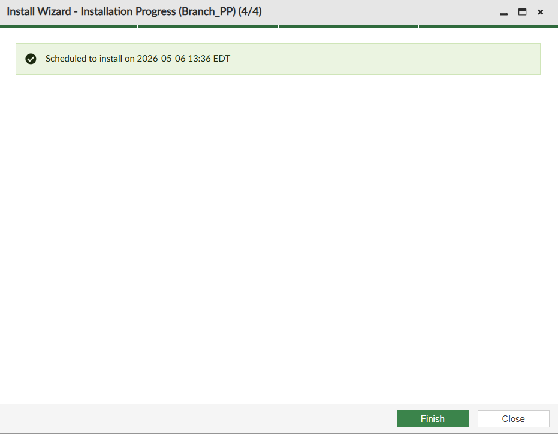{ width="600" }

1. Navigate to System Settings -> Task Monitor and wait until the automatic installation is completed

1. Now let's edit or cancel our schedule

1. Navigate to Policy & Objects -> Policy Packages and select the Firewall Policy **Branch_PP**

1. Click on the clock icon next to the policy package name

    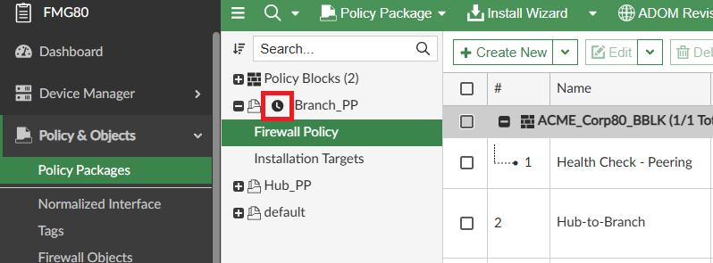{ width="600" }

    ???+ info
        We will cancel the schedule but feel free to edit it or leave it scheduled for tomorrow

1. Click on Cancel Schedule

1. Click on Install Wizard and run the installation of Hub_PP policy

## Use Case: Improved Local Certificate Template

1. Navigate to Device Manager -> Provisioning Templates -> Feature Visibility

1. Enable Certificate and click OK

    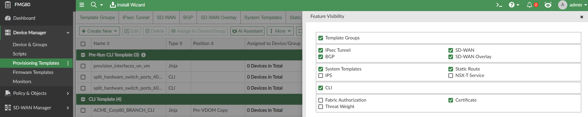{ width="600" }

1. Select the Certificate tab and click **Create New**:

    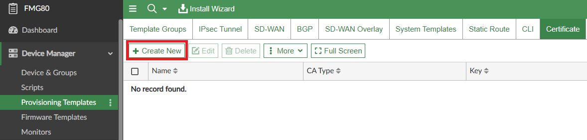{ width="600" }

1. Fill

    - **Name:** local-cert-template

    - **Type:** Local

    ???+ info
        Now on FMG 8.0 there's an option to specify the validity of the certificate in days.

    - **Validity:** Specify: 29 days

    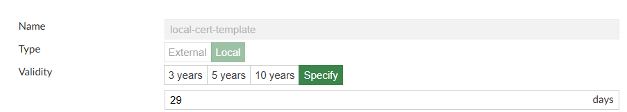{ width="600" }

1. Click OK

1. Select the certificate template and click More -> Certificate Operations

1. Select Branch80, Generate under certificate actions

    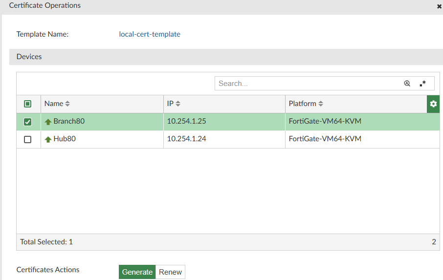{ width="600" }

1. Click OK and the Finish

    ???+ info

        Beginning FMG 8.0 now there are notifications for certificates expiring under 30 days, since we created our template with 29 days, there's already a notification for Branch80.

1. Click on the bell icon to see the notifications

1. Check the notification for expiring certificates and click on Details

    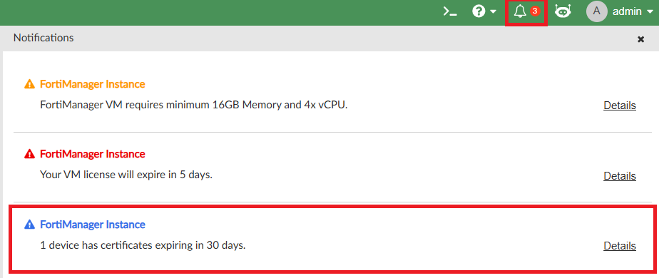{ width="600" }

1. Select the certificate template for Branch80 and click Certificate Operations

    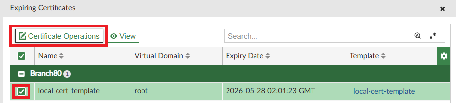{ width="600" }

    ???+ info

        FMG 8.0 can now renew the certificates instead of only issuing new ones.

1. Select Branch80 and click OK to renew it's certificate

    ???+ info

        The notification won't go away because the certificate is still only 29 days away from expiration.

    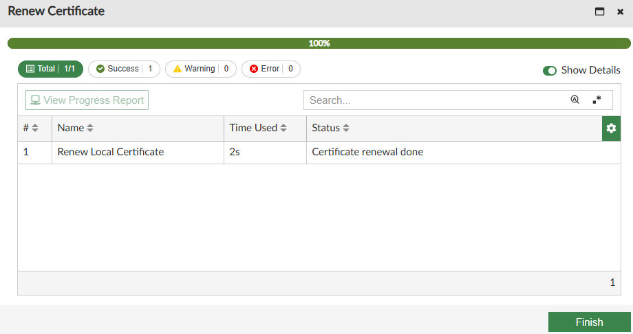{ width="600" }

!!! success

    A list of many other interesting features introduced on FortiManager 8.0 can be found here:  
    <https://docs.fortinet.com/document/fortimanager/8.0.0/new-features/657291/8-0-0>