# FortiAnalyzer 8.0

## Use Case: FortiAnalyzer 8.0 New Features

| Info | Result |
| ---- | ---- |
| Time to Complete | 15 Minutes |
| Dependencies | FortiManager 8.0 New Features |
| About | In this lab we will explore the new feature of FortiMQ connector for automated blocking now available on FortiAnalyzer 8.0 and FortiOS 8.0 |

## Use Case: FortiMQ connector

???+ info

    The new FortiMQ connector allow the distribution of a block list directly from FortiAnalyzer to FortiGate's without the need for a FortiManager like the previous solutions available.   
    FortiGate's in the same FortiCloud account as the FortiAnalyzer will receive the block list synched from FortiAnalyzer to FortiCloud using the new external connector.

1. Open **fmg1-v8** GUI

    ???+ info

        We will use FortiManager to apply the configuration but the same configuration could be done directly on the FGT.

1. Navigate to Device Manager -> Device & Groups, select Branch80 under Managed FortiGate

    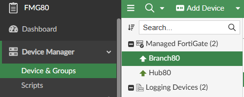{ width="600" }

1. Select the tab CLI Configurations and navigate to system -> external-resource

    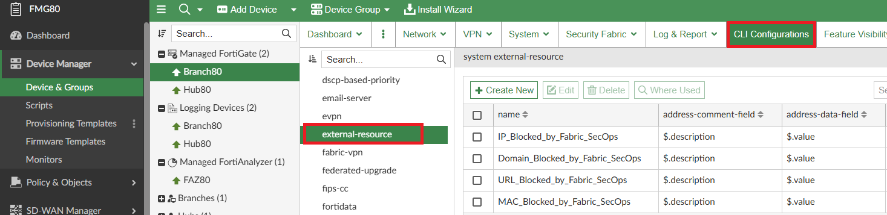{ width="600" }

1. Notice that by default FOS now has 4 external connectors pre-configure but disabled

1. Select the connector IP_Blocked_by_Fabric_SecOps and click Edit

    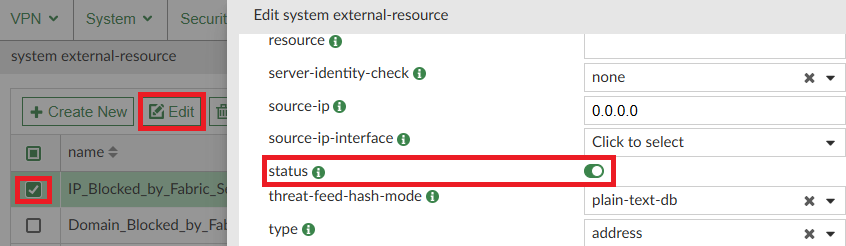{ width="600" }

1. Click OK 

1. Run the Install Wizard to install the Device Settings on Branch80

1. Navigate to Policy & Objects -> Policy Packages and select Branch_PP policy package

1. Click on Create New

    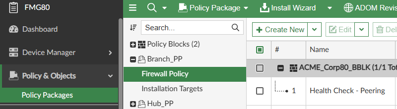{ width="600" }

    ???+ info

        Due to a bug on FortiManager to handle this new connector type, let's create the policy and adjust the destination manually on FGT just for the purpose of this lab.

1. Fill

    - **Name:** SecOps Connector

    - **Action:** Deny

    - **Incoming Interface:** port5

    - **Outgoing Interface:** WAN1

    - **Source:** all

    - **Destination:** gmail.com

    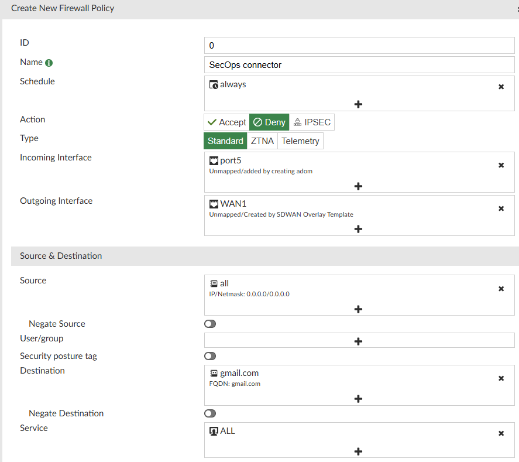{ width="600" }

1. Click OK

1. Move the policy to the first position

    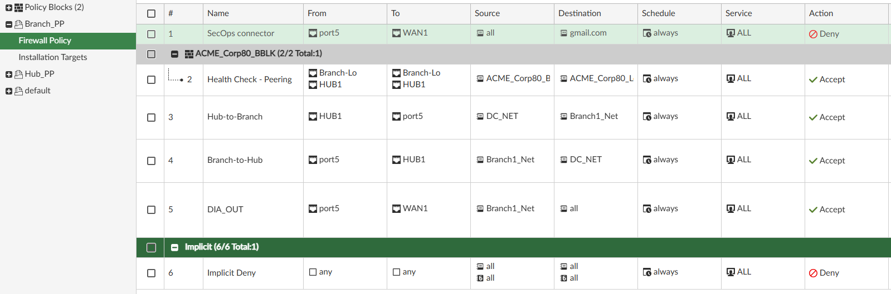{ width="600" }

1. Run the install wizard to install the Branch_PP policy package

1. Open **fgt2-v8** and navigate to Policy & Objects -> Firewall Policy

1. Locate and edit the destination of the SecOps connector policy

    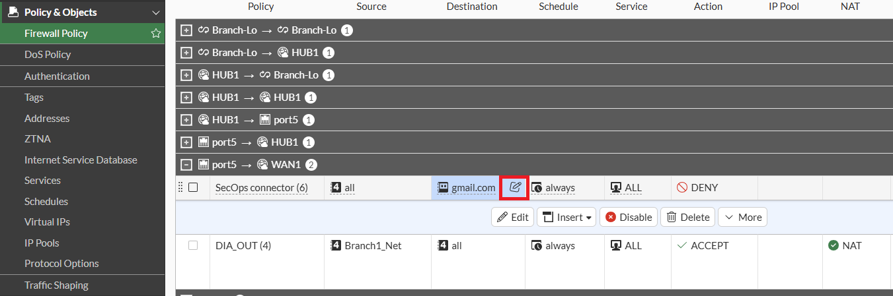{ width="600" }

1. Select the feed IP_Blocked_by_Fabric_SecOps and click OK

    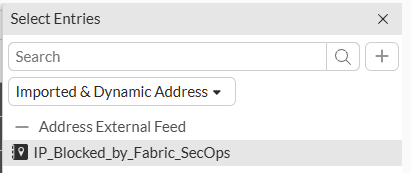{ width="600" }

1. Check that the policy looks like the image

    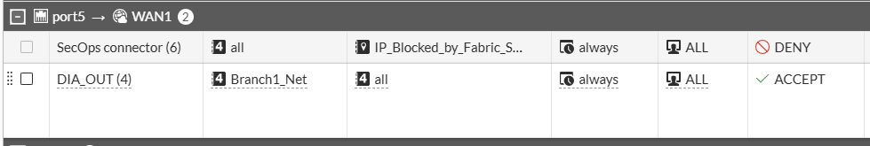{ width="600" }

1. Access **faz1-v8**

1. Navigate to Incidents & Alerts -> Automation -> Active Connectors

1. Enable the FortiMQ Connector

    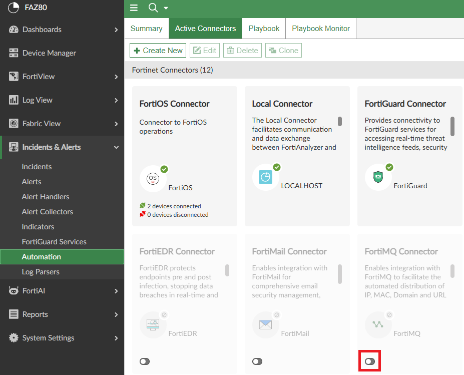{ width="600" }

1. Wait a moment until the connector reports a successful status (refresh the page)

    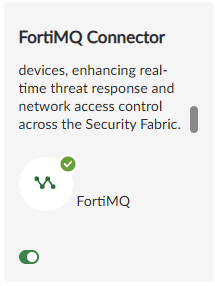{ width="200" }

1. Access **cli2-v8**

1. Run the command bellow to trigger a connection

    ```
    curl -vk https://1.1.1.1
    ```

1. Back on **faz1-v8**, navigate to Log View -> Logs -> Fortinet Logs

1. Find the connection to 1.1.1.1, right click the destination address and click on Create Indicator and Block

    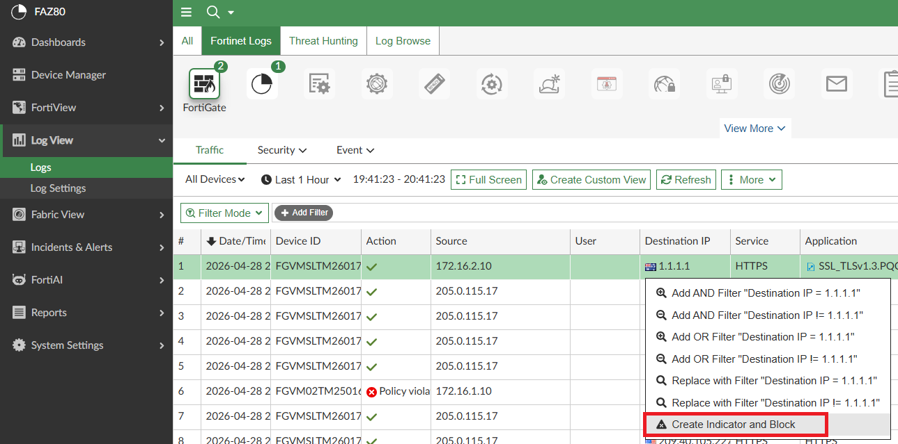{ width="600" }

    ???+ info

        The address will be sent to FortiCloud and synched to the FGT.

1. Back on **fgt2-v8** navigate to Security Fabric -> External Connectors

1. Hover the mouse over the connector and click on View Entries

    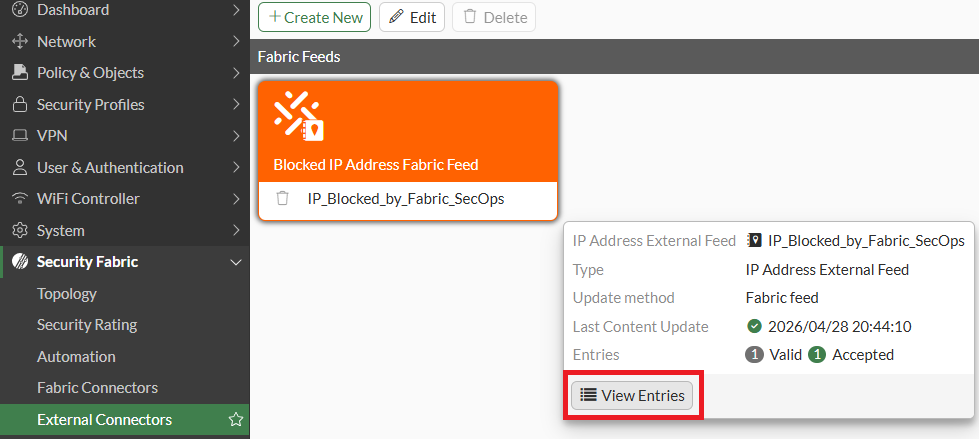{ width="600" }

1. Back on **cli2-v8**, try to run the curl command again to validate that the connection is blocked

    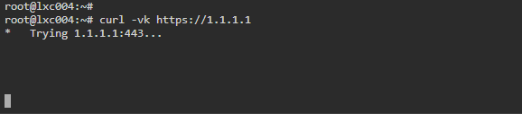{ width="600" }

1. Back on **faz1-v8**, navigate to Incidents & Alerts -> Indicators

1. Select the Indicator created and click Delete

    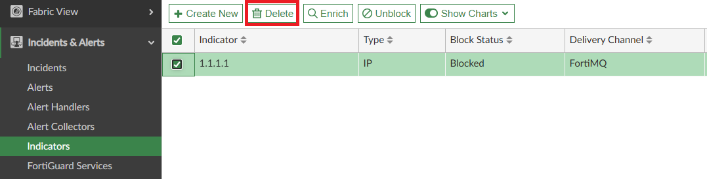{ width="600" }

1. Check that the entry was removed and the connection is allowed again

    ???+ info

        These connectors are ADOM specific, so FGT's on different ADOM's on FortiAnalyzer will have different block lists.

!!! success
    A list of many other interesting features introduced on FortiAnalyzer 8.0 can be found here:  
    <https://docs.fortinet.com/document/fortianalyzer/8.0.0/new-features/238227/8-0-0>