# SD-WAN 8.0

## Use Case: SD-WAN 8.0 New Features

| Info | Result |
| ---- | ---- |
| Time to Complete | 20 Minutes |
| Dependencies | N/A |
| About | In this lab we will explore some new SD-WAN features introduce in 8.0 |

## Use Case: Application Performance FortiView

???+ note

    Application Performance Monitoring (APM) was introduced in 7.6 and the new FOS 8.0 introduced a graphic view directly on FortiOS using the restructured FortiView widgets.

1. Open **fmg1-v8** and navigate to Policy & Objects -> Policy Packages and select the HUB_PP policy

1. Select the DIA_OUT policy and click Edit

    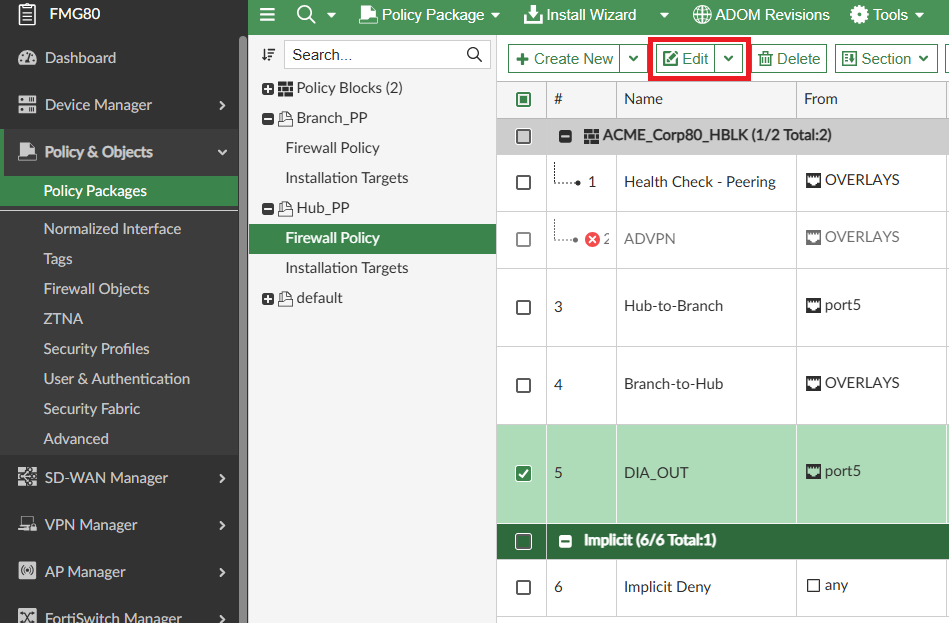{ width="600" }

1. Scroll down to Advanced Options and enable:

    - **app-monitor:** :white_check_mark:

    - **passive-wan-health-measurement:** :white_check_mark:

    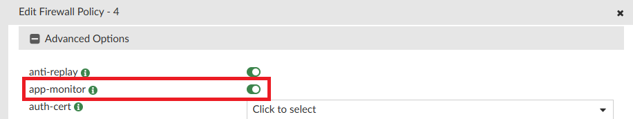{ width="600" }  

    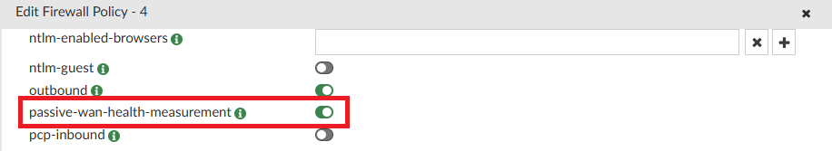{ width="600" }

    ???+ note

        On FortiOS 8.0 these options can be enabled with a single option called **Log application health metrics** on the firewall policy configuration:  
        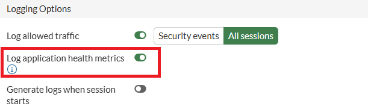{ width="600" }

1. Click OK

1. Run the Install Wizard to install the policy package HUB_PP

1. Open **fgt1-v8** (Hub80) and click on Add dashboard/monitor

    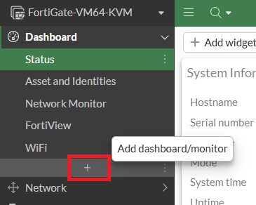{ width="600" }

1. Name it **APM**, select the Layout Type **Monitor** and click **Choose Monitor**:

    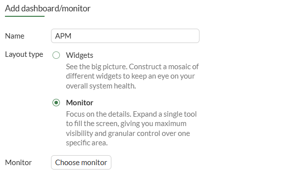{ width="600" }

1. Search and select the FortiView SD-WAN Application Performance

    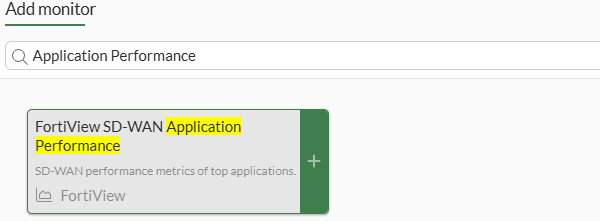{ width="600" }

1. On **Data source** select **Specify** and change the device to **FortiGate**

    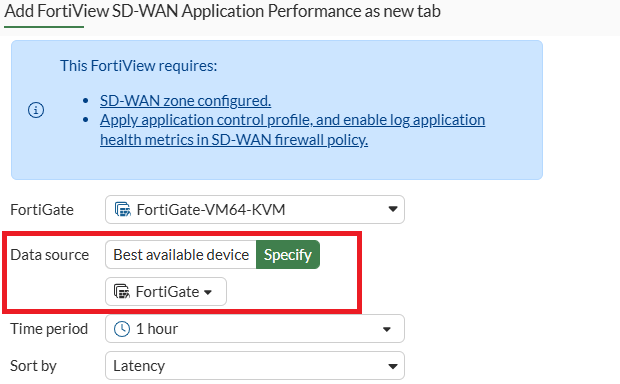{ width="600" }

    ???+ info

        The reason to change the log source for the local disk instead of FAZ is because there's a known issue on FAZ 8.0 that is planned to be fixed on 8.0.1.

1. Click OK and then Click OK

1. Open **win-cli1-v8**

1. Open the browser and navigate to some webpages like:

    ```
    https://instagram.com
    ```

    ```
    https://office.com
    ```

1. Back on **fgt1-v8** (Hub80), check that the Dashboard is now populated with Application Performance Metrics:

    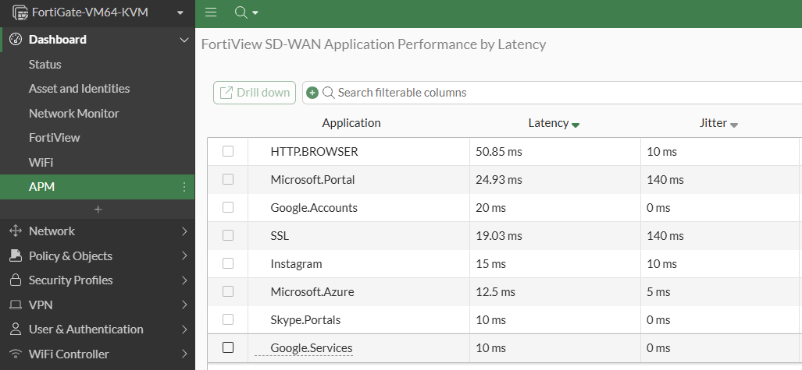{ width="600" }

    ???+ tip

        Although we enabled the collection of Application Performance Metrics for all the traffic on FOS, this isn't likely going to be a viable strategy in production since NP acceleration is disabled for this feature to work. The most likely scenario to be implemented in production is the strategy of sampling, e.g, a rule with only some source IP's of each LAN network is created above the Internet Access rule and the feature is enabled only on this rule for this limited number of source IPs and not for the entire network.

## Use Case: Underlay bandwidth steering

???+ info

    For a long time FortiOS supports the use of inbandwidth, outbandwidth or bibandwidth as hash-mode's for loadbalancing traffic on multiple SD-WAN interfaces. However before 8.0 these metrics were analyzed on the SD-WAN interface level, e.g an SD-WAN rule with overlay interfaces would be load balanced considering the tunnel interface bandwidth. Some environments might be in a situation where it makes sense to consider the underlay interface utilization instead of the overlay.  

    In FortiOS 8.0, if an SD-WAN rule is configured for loadbalancing between 2 Overlays, but for some reason the underlay utilization of WAN1 is greater than WAN2, if this option is configured, the load balanced traffic will prefer WAN2 until the utilization between WAN1 and WAN2 equalizes and then start to send traffic to WAN1 as well.

1. Open **fmg1-v8**, navigate to SD-WAN Manager -> Rules, select Branch_SDWAN and click Edit

    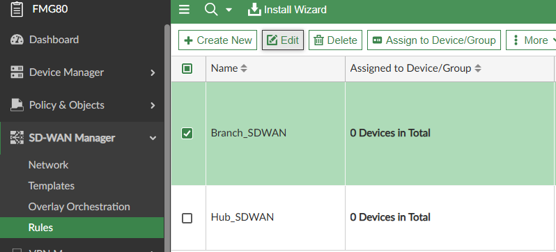{ width="600" }

1. Scroll down to SD-WAN rules and click Create New

1. Fill

    - **Name:** HUB_traffic

    - **Source Address:** Branch1_Net

    - **Destination Address:** DC_NET

    - **Outgoing Interfaces Strategy:** Lowest Cost (SLA)

    - **Zone Preference:** HUB1

    - **Required SLA Target:** HUB#1

    - **Load balancing:** :white_check_mark:

    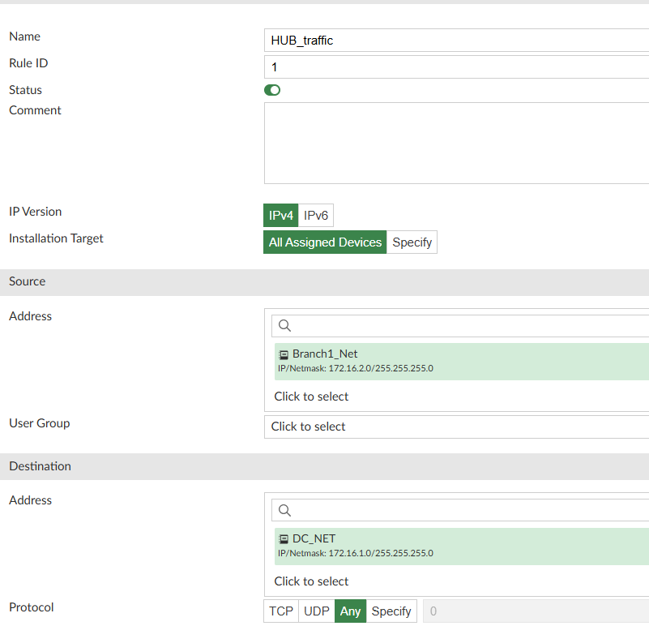{ width="600" }

    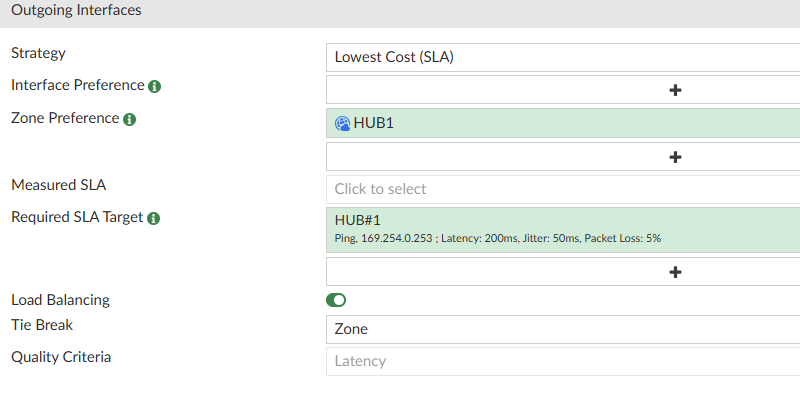{ width="600" }

1. Expand Advanced Options

    - **bandwidth-type:** underlay (New option introduced in FOS8.0)

    - **hash-mode:** bibandwidth

    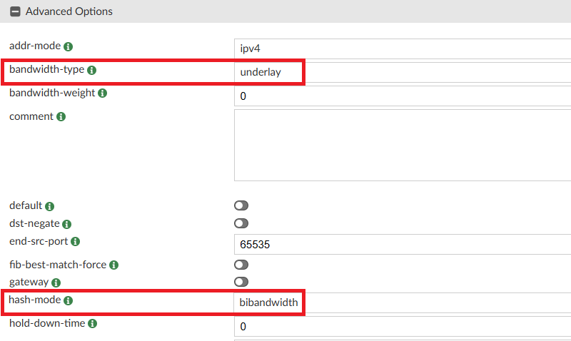{ width="600" }

1. Click OK and the click OK

1. Navigate to Policy & Objects -> Policy Packages, select Branch_PP and click Create New

    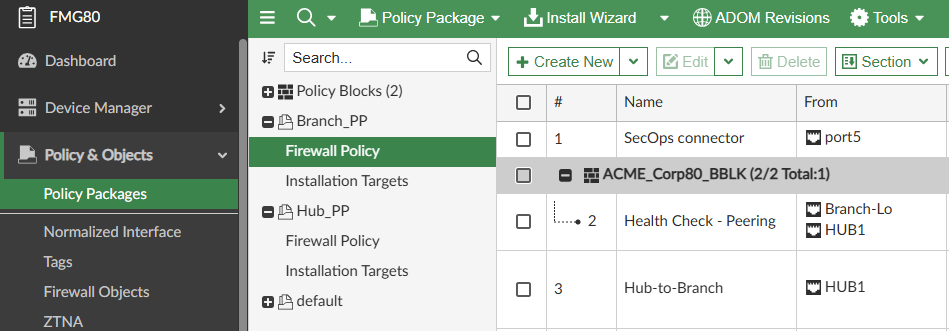{ width="600" }

1. Fill

    - **Name:** underlay-test

    - **Action:** Accept

    - **Incoming Interface:** port5

    - **Outgoing Interface:** WAN2 and WAN3

    - **NAT:** :white_check_mark:

    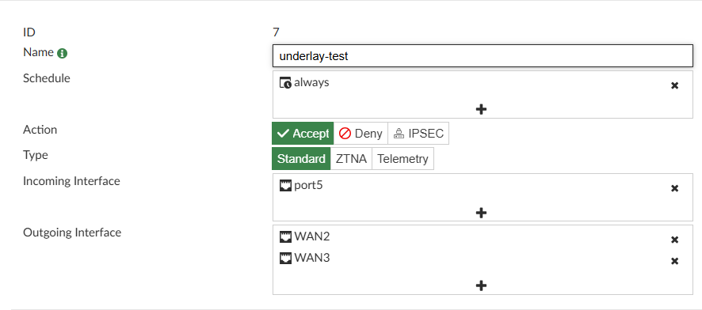{ width="600" }

1. Run the Install Wizard to install Branch Policy Package

1. Open 2 SSH connections to **cli2-v8**

1. In the first session execute the ping command 2 times:

    ```
    ping 172.16.1.1 -c 3
    ping 172.16.1.1 -c 3
    ```
1. Open **fgt2-v8 (Branch80)** and navigate to Log & Report -> Forward Traffic

1. Open the details of both logs to check the chosen interface
    
    ???+ info

        The logs will take up to 1 minute to appear (icmp session timeout)  
        You can also check the destination interface in Dashboard -> FortiView -> Sessions or run a diag sys session clear for icmp sessions if you want to speed things up

    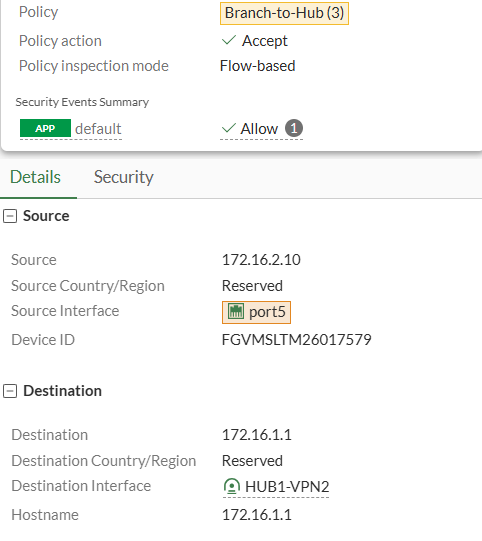{ width="600" }

    ???+ info

        Take a moment to check the new quick overview added in log details in FOS 8.0

1. Now on the second SSH session to  **cli2-v8** run the command according to the interface being used in the logs

    ```
    If HUB1-VPN1 run: ping -i 0.01 -l 1400 -q 205.0.115.9
    If HUB1-VPN2 run: ping -i 0.01 -l 1400 -q 10.6.1.1
    If HUB1-VPN3 run: ping -i 0.01 -l 1400 -q 10.7.1.1
    If HUB1-VPN3 also enable PING on port7 interface on Hub80, this can be done directly on Hub80 for the purpose of this lab
    ```

    ???+ info

        We are pinging the interface address of Hub80 to increase the interface underlay bandwidth utilization

1. Open the first SSH session to **fgt2-v8 (Branch80)** and repeat the fist ping:

    ```
    ping 172.16.1.1 -c 3
    ```

1. Back on **fgt2-v8 (Branch80)**, verify that now the connection to 172.16.1.1 is taking another path influenced by the increase in the underlay bandwidth

!!! success

    A list of many other interesting features introduced on SD-WAN in 8.0 can be found here:  
    <https://docs.fortinet.com/document/fortigate/8.0.0/sd-wan-new-features/431753/whats-new-in-8-0-0>