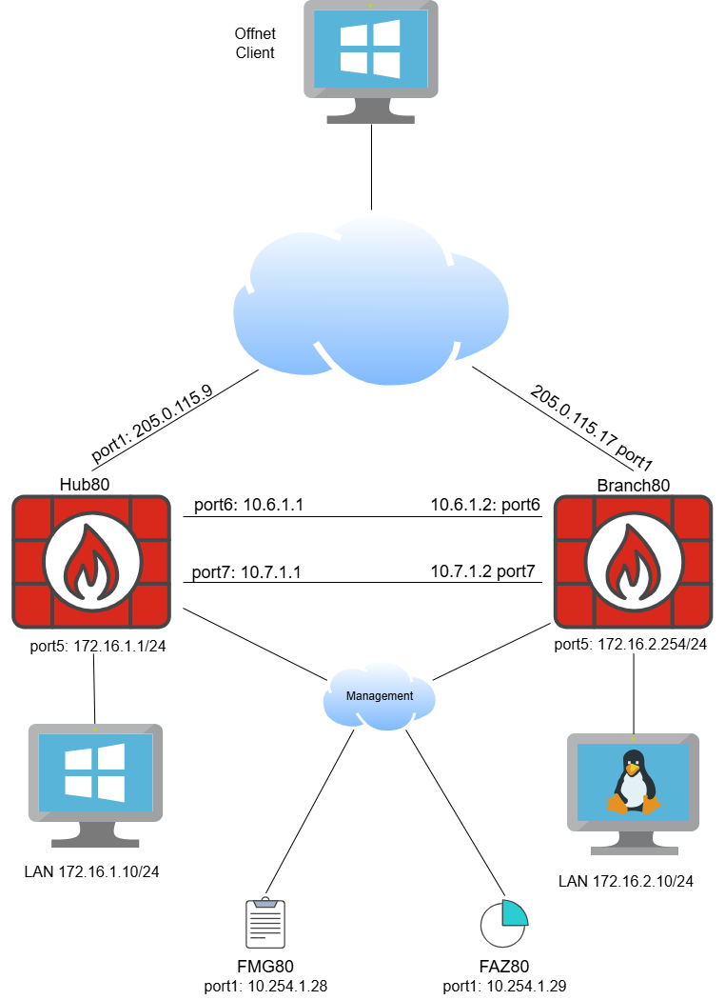

# FortiOS 8.0 New Features

## Lab 1: Base configuration Review

| Info | Result |
| ---- | ---- |
| Time to Complete | 10 Minutes |
| Dependencies | N/A |
| About | In this Lab you will explore the base configuration of our lab environment. |

Before we roll our sleeves and dive deep into the hands-on exercise, let us first explore this standalone lab (a subset of the lab environment in Fabric Studio).

Below you can find the topology diagram which depicts how the components that you will use in this LAB are connected.

{width="600"}

The Lab topology consists on 2x FortiGates (1 Hub and 1 Spoke), FortiManager, FortiAnalyzer and 3 endpoints (one external and 2 internals). 

***fgt1-v8*** simulates the HQ location where most of the services such as remote access, DC apps etc are hosted. ***fgt2-v8*** is the branch that where on-net users will be accessing  applications at HQ. ***fmg1-v8*** will be our FortiManager for centralized access that is also managing ***faz1-v8***, meaning that you will access FortiAnalyzer features within FortiManager. We have used the SD-WAN Overlay Template (SOT) feature to quickly spin up the SDWAN topology utilizing ports 6 and 7 from each site as underlays. 

Although it is not shown on the diagram, this lab environment can reach the same FortiSASE instance you worked on in the the previous labs, we will use this to demonstrate the new way of configuring ZTNA in the FortiGates.

All the devices are connected to the out of band management network for easy access to their management interfaces. Finally, all the Fortinet appliances in this section of the lab are running Version 8.0.

All of the appliances can be accessed using the same Dashboard as before. Below is a summary of the appliances used in this Module:

| Device | Hostname | Management IP | Device Type | Credentials | Purpose |
| ---- | ---- | ---- | ---- | ---- | ---- |
| fgt1-v8 | Hub80 | 10.254.1.24 | FortiGate |  admin/Fortinet123# | Used as HQ site |
| fgt2-v8 | Branch80 | 10.254.1.25 | FortiGate | admin/Fortinet123# | Used as Spoke |
| fmg1-v8 | FMG80 | 10.254.1.28 | FortiManager | admin/Fortinet123# | Centralized Management |
| faz1-v8 | FAZ80 | 10.254.1.29 | FortiAnalyzer | admin/Fortinet123# | Centralized Analytics |
| win-cli1-site1 | N/A | 10.254.1.14 | Windows Host | fortinet/Fortinet123# | Off-net endpoint |
| win-cli1-v8 | N/A | 10.254.1.26 | Windows Host | fortinet/Fortinet123# | On-net endpoint at HQ |
| cli-v8 | N/A | 10.254.1.34 | Linux Host | root/Fortinet123# | On-net endpoint at the Branch |

Now that we have reviewed the base lab topology, let us begin exploring some of the new features of FortiOS 8
